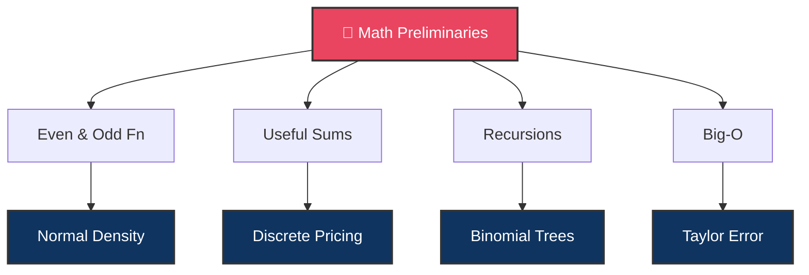

# 🔢 Day 1: Mathematical Preliminaries

> [!target] **Goal**
> Build the pre-calculus toolkit that the entire primer rests on — even/odd functions, summation tricks, linear recursions, and asymptotic notation.

> [!nav] **Navigation**
> **← [[FE Math Primer MOC|📐 Home]]** | **Next → [[FE Day 02 - Calculus Review and Options Intro|Day 2: Calculus ∫]]**

---

## Concept Map

---

## Topics

### 1. Even and Odd Functions

> [!def] Definition
> - **Even**: $f(-x) = f(x)$ — symmetric about y-axis
> - **Odd**: $f(-x) = -f(x)$ — antisymmetric

> [!important] Key Property
> $$\int_{-a}^{a} f(x)\,dx = \begin{cases} 2\int_{0}^{a} f(x)\,dx & \text{if } f \text{ even} \\ 0 & \text{if } f \text{ odd} \end{cases}$$

> [!money] Finance Connection
> The standard normal density $\varphi(x)$ is **even** → this is why $N(-d) = 1 - N(d)$ in Black-Scholes

---

### 2. Useful Sums

> [!def] Geometric Series
> $$\sum_{k=0}^{n} r^k = \frac{1 - r^{n+1}}{1 - r}, \quad r \neq 1$$

> [!money] Finance Connection
> Bond coupon present values, annuity pricing — all geometric series at their core

---

### 3. Linear Recursions

> [!def] Method
> For $a_n = c_1 a_{n-1} + c_2 a_{n-2}$, solve the **characteristic equation** $x^2 = c_1 x + c_2$

> [!money] Finance Connection
> Backward induction in binomial trees IS solving a recursion. CRR tree pricing works this way.

---

### 4. Big-O and Little-o Notation

> [!def] Definitions
> - $f(x) = O(g(x))$ means $|f(x)| \leq C|g(x)|$ for large $x$
> - $f(x) = o(g(x))$ means $f(x)/g(x) \to 0$

> [!money] Finance Connection
> Error analysis of numerical integration ([[FE Day 04 - Numerical Integration and Interest Rates|Day 4]]), Taylor remainder terms ([[FE Day 10 - Taylor Formula and Series|Day 10]])

---

## Interview Preparation

> [!question] **Q1: Symmetry and Expected Values**
> *"If I told you the standard normal PDF is symmetric, what can you immediately say about $E[Z]$ and $E[Z^3]$?"*

> [!success] **Expected Answer**
> - $E[Z] = 0$ — odd function × even density = odd → integrates to zero
> - $E[Z^3] = 0$ — same reasoning
> - But $E[Z^2] = 1$ — even × even = even → nonzero

> [!question] **Q2: Black-Scholes Simplification**
> *"How does this symmetry help simplify Black-Scholes computations?"*

---

## Exercises to Complete

- [ ] **Exercise 1:** Prove the geometric series formula by multiplying both sides by $(1-r)$
- [ ] **Exercise 2:** Show that if $f$ is even and $g$ is odd, then $fg$ is odd
- [ ] **Exercise 3:** Solve: $a_n = 5a_{n-1} - 6a_{n-2}$ with $a_0 = 1, a_1 = 1$
- [ ] **Exercise 4:** Express the Trapezoidal rule error using big-O notation

---

## Study Materials

> [!abstract] **Study Materials**
> *This section will be populated as you work through Day 1. Derivations, insights, and code go here.*

---

#FE-primer #day-01 #foundations #mathematics #preliminaries
