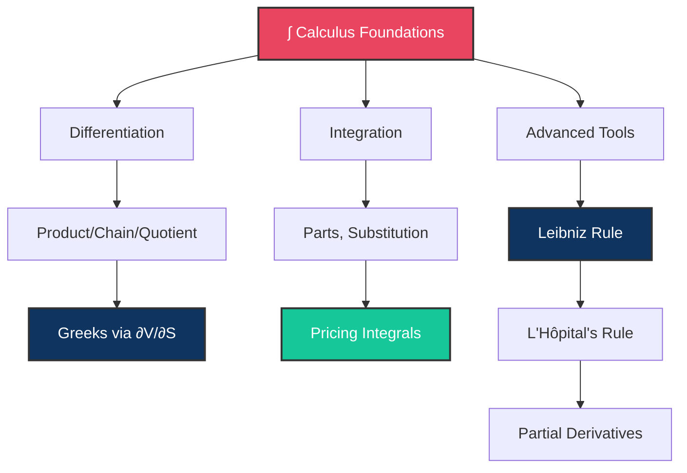

# ∫ Day 2: Calculus Review and Options Introduction

> [!target] **Goal**
> Sharpen the calculus tools you'll use every day in quant finance — differentiation, integration, limits, L'Hôpital, and multivariable functions.

> [!nav] **Navigation**
> **← [[FE Day 01 - Mathematical Preliminaries|Day 1: Preliminaries]]** | **Home:** [[FE Math Primer MOC|📐 Home]] | **Next → [[FE Day 03 - Options and Arbitrage-Free Pricing|Day 3: Options]]**
>
> **Aliases:** Day 2, Calculus Review

---

## Concept Map



---

### 1. Differentiation Review

> [!def] **Core Concept**
> Calculus studies how functions change. The derivative $f'(x) = \lim_{h \to 0} \frac{f(x+h) - f(x)}{h}$ measures instantaneous rate of change.

> [!important] **Essential Rules**
> - **Product rule:** $(fg)' = f'g + fg'$
> - **Chain rule:** $(f \circ g)' = f'(g(x)) \cdot g'(x)$
> - **Quotient rule:** $\left(\frac{f}{g}\right)' = \frac{f'g - fg'}{g^2}$

> [!money] **Finance Connection**
> Every Greek is a partial derivative of the option pricing function:
> - $\Delta = \frac{\partial C}{\partial S}$ (sensitivity to stock price)
> - $\Gamma = \frac{\partial^2 C}{\partial S^2}$ (convexity)
> - $\Vega = \frac{\partial C}{\partial \sigma}$ (volatility sensitivity)

---

### 2. Integration Review

> [!def] **Core Concept**
> Integration is the inverse of differentiation. Definite integral $\int_a^b f(x)dx$ represents the signed area under the curve.

> [!important] **Essential Techniques**
> - **Integration by parts:** $\int u \, dv = uv - \int v \, du$
> - **Substitution:** $\int f(g(x)) \cdot g'(x) \, dx = \int f(u) \, du$ where $u = g(x)$
> - **Partial fractions:** Decompose rational functions into simpler terms

> [!money] **Finance Connection**
> Risk-neutral pricing requires computing expectations as integrals:
> $$C_0 = e^{-rT} \mathbb{E}^Q[\max(S_T - K, 0)] = e^{-rT} \int_K^\infty (s - K) \cdot f_Q(s) \, ds$$
> where $f_Q$ is the risk-neutral density.

---

### 3. Differentiating Definite Integrals (Leibniz Rule)

> [!def] **Leibniz Integral Rule**
> To differentiate under the integral sign:
> $$\frac{d}{dx} \int_{a(x)}^{b(x)} f(x,t) \, dt = f(x,b(x)) \cdot b'(x) - f(x,a(x)) \cdot a'(x) + \int_{a(x)}^{b(x)} \frac{\partial f}{\partial x} \, dt$$

> [!important] **When to Use**
> Apply Leibniz when the integrand or limits depend on the differentiation variable.

> [!money] **Finance Connection**
> This is **how** you derive the Greeks analytically from the Black-Scholes integral form:
> $$\Delta = \frac{\partial C}{\partial S} = \frac{\partial}{\partial S} \int_{-\infty}^{d_2} e^{-\frac{z^2}{2}} \, dz$$
> Leibniz rule handles the dependence of $d_2$ on $S$ and the upper limit behavior.

---

### 4. Limits and L'Hôpital's Rule

> [!def] **L'Hôpital's Rule**
> If $\lim_{x \to a} \frac{f(x)}{g(x)}$ produces $\frac{0}{0}$ or $\frac{\infty}{\infty}$, then:
> $$\lim_{x \to a} \frac{f(x)}{g(x)} = \lim_{x \to a} \frac{f'(x)}{g'(x)}$$
> (provided the limit on the right exists)

> [!important] **Key Edge Cases**
> - As $T \to 0$ (approaching expiry): what happens to option prices?
> - As $\sigma \to 0$ (volatility drops to zero): what is the intrinsic value?
> - As $S \to \infty$: call price behaves like stock price minus strike

> [!money] **Finance Application**
> Analyze boundary behavior of Black-Scholes formula at expiry and extreme parameter values using limits and L'Hôpital.

---

### 5. Functions of Two (or More) Variables

> [!def] **Multivariable Calculus**
> Partial derivatives measure change in one direction while holding others constant:
> $$\frac{\partial f}{\partial x} = \lim_{h \to 0} \frac{f(x+h, y) - f(x, y)}{h}$$
>
> The gradient is the vector of all partial derivatives: $\nabla f = \left(\frac{\partial f}{\partial x}, \frac{\partial f}{\partial y}\right)$

> [!important] **Mixed Partials**
> Under reasonable conditions (continuity), $\frac{\partial^2 f}{\partial x \partial y} = \frac{\partial^2 f}{\partial y \partial x}$

> [!money] **Finance Connection**
> Option prices depend on multiple state variables: $V(S, t, \sigma, r, q)$
> - The option price **surface** $V(S, t)$ is a 3D surface in $(S, t, V)$ space
> - Greeks are partial derivatives of this surface
> - Mixed partials reveal interactions: e.g., $\frac{\partial \Delta}{\partial t}$ = change in delta over time

---

## Interview Preparation

> [!question] **Q1: Compute d/dS of the Black-Scholes Call Price**
> "Compute $\frac{d}{dS} C_{BS}(S, K, T, \sigma, r)$ and explain what you get."

> [!success] **Expected Answer**
> You should derive $\Delta = N(d_1)$, where:
> - Use the chain rule since $d_1$ depends on $S$
> - Apply Leibniz rule if working from the integral representation
> - The key insight: $d_1 = \frac{\ln(S/K) + (r + \sigma^2/2)T}{\sigma\sqrt{T}}$ means $\frac{\partial d_1}{\partial S} = \frac{1}{S\sigma\sqrt{T}}$
> - Result: $\Delta = N(d_1)$ (the cumulative normal of $d_1$)

> [!question] **Q2: Chain Rule Subtlety**
> "Why is $\frac{d}{dS} N(d_1) \neq \phi(d_1)$?"

> [!success] **Expected Answer**
> Because $d_1$ itself depends on $S$! By chain rule:
> $$\frac{d}{dS} N(d_1) = \underbrace{\phi(d_1)}_{\text{derivative of N}} \cdot \underbrace{\frac{\partial d_1}{\partial S}}_{\text{chain rule}} \neq \phi(d_1)$$
> This is why you get $\Delta = N(d_1)$, not $\phi(d_1)$.

> [!question] **Q3: Leibniz in Practice**
> "When would you use Leibniz rule in derivatives pricing?"

> [!success] **Expected Answer**
> When you need to differentiate an expression like:
> $$\frac{\partial}{\partial S} \int_K^\infty (s - K) \phi(s) \, ds$$
> The limits change with $S$, and the integrand may depend on $S$ through the density. Leibniz handles both.

---

## Exercises to Complete

> [!abstract] **Practice Problems**

- [ ] **Exercise 1**: Compute $\displaystyle \int_0^\infty x \cdot e^{-x^2/2} \, dx$ (useful for $\mathbb{E}[Z^+]$ calculations where $Z \sim N(0,1)$)

- [ ] **Exercise 2**: Apply Leibniz rule to differentiate $F(x) = \displaystyle \int_0^x e^{-t^2} \, dt$ with respect to $x$

- [ ] **Exercise 3**: Evaluate $\displaystyle \lim_{\sigma \to 0} C_{BS}(S, K, T, \sigma, r)$ using L'Hôpital's rule

- [ ] **Exercise 4**: Compute all first partial derivatives of $f(x, y) = x \cdot e^{-y^2/2}$ and verify Schwarz' theorem (mixed partials are equal)

---

## Detailed Notes

> [!abstract] **Study Materials**
> *Populated during study — store key derivations, worked examples, and personal notes here.*

---

## Code Implementation

> [!code] **Numerical & Symbolic Differentiation**
> ```python
> import numpy as np
> from scipy.stats import norm
> import sympy as sp
>
> # Numerical differentiation: approximate Delta
> def numerical_delta(S, K, T, sigma, r, h=1e-5):
>     C_up = black_scholes_call(S + h, K, T, sigma, r)
>     C_down = black_scholes_call(S - h, K, T, sigma, r)
>     return (C_up - C_down) / (2 * h)
>
> # Symbolic differentiation: exact Greeks
> S, K, T, sigma, r = sp.symbols('S K T sigma r', positive=True, real=True)
> d1 = (sp.ln(S/K) + (r + sigma**2/2)*T) / (sigma * sp.sqrt(T))
> C = S * sp.Normal(0, 1).cdf(d1) - K*sp.exp(-r*T) * sp.Normal(0, 1).cdf(d1 - sigma*sp.sqrt(T))
> delta = sp.diff(C, S)
> ```

---

#FE-primer #day-02 #calculus #differentiation #integration
