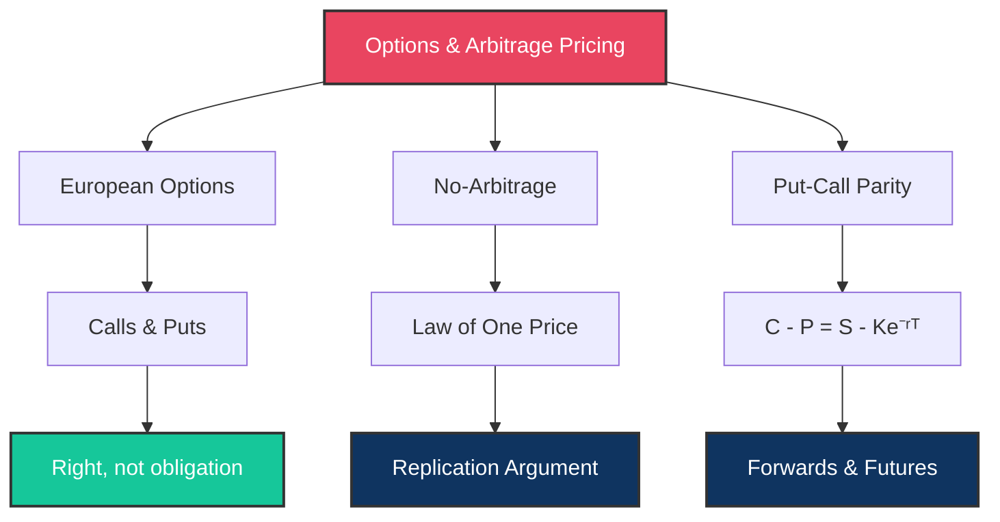

# 📈 Day 3: Options and Arbitrage-Free Pricing

> [!target] **Goal**
> Understand the financial instruments that all the math serves — calls, puts, forwards, futures — and the no-arbitrage principle that prices them.

> [!nav] **Navigation**
> **← [[FE Day 02 - Calculus Review and Options Intro|Day 2: Calculus]]** | **Home:** [[FE Math Primer MOC|📐 Home]] | **Next → [[FE Day 04 - Numerical Integration and Interest Rates|Day 4: Num. Integration]]**
>
> **Aliases:** Day 3, Options Intro, Arbitrage-Free Pricing
> **Key Links:** [[Put-Call Parity]], [[Risk-Neutral Pricing]]

---

## Concept Map



---

### 1. European Calls and Puts

> [!def] **Definitions**
> - **European Call:** Right (but not obligation) to buy stock at strike $K$ at maturity $T$
>   - Payoff at maturity: $\max(S_T - K, 0)$
> - **European Put:** Right (but not obligation) to sell stock at strike $K$ at maturity $T$
>   - Payoff at maturity: $\max(K - S_T, 0)$

> [!important] **Position Types**
> - **Long Call:** Buyer (expects stock to rise), profits when $S_T > K$
> - **Short Call:** Seller (collects premium, expects stock to stay flat/fall), profits when $S_T < K$
> - **Long Put:** Buyer (downside protection), profits when $S_T < K$
> - **Short Put:** Seller (collects premium), profits when $S_T > K$

> [!money] **First Principle**
> An option is a **right without obligation**. This asymmetry is why options have value: you exercise only when favorable, never when unfavorable. This creates the convexity that makes options valuable for hedging and speculation.

---

### 2. Arbitrage-Free Pricing

> [!def] **The Law of One Price**
> If two portfolios produce **identical cash flows** at all future times, they **must have the same price today**. Otherwise, there exists arbitrage: a risk-free profit.

> [!important] **The Arbitrage Argument**
> If Portfolio A costs less than Portfolio B but they have identical payoffs:
> 1. Buy the cheaper portfolio (A)
> 2. Short-sell the expensive portfolio (B)
> 3. Collect the price difference **risk-free**
> 4. At maturity, identical payoffs cancel out perfectly
> 5. Result: guaranteed profit with zero risk and zero initial capital

> [!important] **Why Markets Correct**
> Arbitrage opportunities are seized immediately by traders, causing:
> - High demand for underpriced asset → price rises
> - High supply of overpriced asset → price falls
> - Market converges to the arbitrage-free price

> [!money] **Universal Pricing Principle**
> This single idea (no arbitrage = Law of One Price) prices **every derivative** in finance. No need to know investor risk preferences, market expectations, or probability distributions—only that arbitrage-free pricing must hold.
>
> **Connection to [[Risk-Neutral Pricing]]:** The no-arbitrage principle allows us to price derivatives using risk-neutral probabilities rather than real-world probabilities.

---

### 3. Put-Call Parity (Key Formula)

> [!def] **The Put-Call Parity Relationship**
> $$C(S, K, T, r) - P(S, K, T, r) = S - K e^{-rT}$$
>
> where:
> - $C$ = European call price today
> - $P$ = European put price today
> - $S$ = stock price today
> - $K$ = strike price
> - $T$ = time to maturity
> - $r$ = risk-free rate

> [!important] **Proof by Replication**
> **Portfolio A:** Long call + Cash ($K e^{-rT}$ invested at rate $r$)
> - Cost today: $C + K e^{-rT}$
> - Value at maturity: $\max(S_T - K, 0) + K = \max(S_T, K)$
>
> **Portfolio B:** Long put + Long stock
> - Cost today: $P + S$
> - Value at maturity: $\max(K - S_T, 0) + S_T = \max(S_T, K)$
>
> Both portfolios have identical payoff $\max(S_T, K)$ at maturity.
> By the Law of One Price:
> $$C + K e^{-rT} = P + S$$
> $$C - P = S - K e^{-rT}$$

> [!important] **What This Tells Us**
> If you know any three of {$C$, $P$, $S$, $K$, $r$, $T$}, you can compute the fourth using put-call parity.
> This is your **arbitrage detection tool**: if markets violate this, trade it immediately.

> [!money] **With Dividends**
> If the stock pays continuous dividend yield $q$:
> $$C - P = S e^{-qT} - K e^{-rT}$$
> The stock term gets discounted by the dividend yield because you lose dividends if you own the call but don't own the stock.

---

### 4. Forwards and Futures

> [!def] **Forward Contract**
> An agreement to buy/sell an asset at a **predetermined price** $F$ at a **future date** $T$. Unlike options, both parties are **obligated** to transact.

> [!important] **No-Arbitrage Forward Price**
> The forward price that prevents arbitrage is:
> $$F = S \cdot e^{rT}$$
>
> **Derivation:**
> - Borrow $S$ at rate $r$ (cost today: 0; repay $S e^{rT}$ at time $T$)
> - Buy the stock (cost: $S$)
> - Enter short forward at price $F$ (receive $F$ at time $T$)
> - At time $T$: sell stock for $F$, repay loan $S e^{rT}$, profit: $F - S e^{rT}$
> - For no-arbitrage: $F = S e^{rT}$

> [!important] **Futures vs. Forwards**
> | Feature | Forwards | Futures |
> |---------|----------|---------|
> | **Settlement** | Single payment at maturity | Daily marking-to-market |
> | **Standardization** | Custom contracts | Exchange-standardized |
> | **Counterparty Risk** | Direct (with counterparty) | Minimal (clearinghouse) |
> | **Margin** | None initially | Daily variation margin |
> | **Convexity Adjustment** | None | Present when rates/volatility change |
>
> For interest rate futures, daily marking can create "convexity bias" that differs from the theoretical forward rate.

> [!money] **Finance Connection**
> Forwards and futures are building blocks for:
> - Interest rate derivatives ([[FE Day 04 - Numerical Integration and Interest Rates|Day 4]])
> - Cross-currency hedging
> - Commodity hedging in supply chains

---

## Interview Preparation

> [!question] **Q1: State and Prove Put-Call Parity**
> "In 60 seconds, state put-call parity and prove it using a replication argument."

> [!success] **Expected Answer**
> **Formula:** $C - P = S - K e^{-rT}$
>
> **Proof:** Construct two portfolios with identical terminal payoffs:
> - **Portfolio A:** Buy call + invest $K e^{-rT}$ in risk-free bond
> - **Portfolio B:** Buy put + buy stock
> - At maturity, both are worth $\max(S_T, K)$
> - By no-arbitrage, they cost the same today
> - This gives the put-call parity formula
>
> **Bonus:** Mention that violations create arbitrage opportunities.

> [!question] **Q2: Does Put-Call Parity Hold for American Options?**
> "Put-call parity holds for European options. What about American options?"

> [!success] **Expected Answer**
> **No, only an inequality holds:**
> $$S - K \leq C_{Am} - P_{Am} \leq S - K e^{-rT}$$
>
> **Why:** American options have early exercise rights. An American call might be exercised early if dividends are paid, or an American put might be exercised early if the stock crashes. These early exercise features break the exact equality and create bounds instead.
> - Lower bound: $C_{Am} - P_{Am} \geq S - K$ (early exercise of put)
> - Upper bound: $C_{Am} - P_{Am} \leq S - K e^{-rT}$ (time value)

> [!question] **Q3: Direct Application**
> "A call costs \$5, stock is at \$100, strike is \$100, $r = 5\%$ annual, $T = 1$ year. What should the put cost?"

> [!success] **Expected Answer**
> Use put-call parity: $P = C - S + K e^{-rT}$
> $$P = 5 - 100 + 100 \cdot e^{-0.05} = 5 - 100 + 95.12 = \$0.12$$
>
> **Interpretation:** The put is cheap because it's ATM and only has 1 year of time value. Most of the put value is lost to the intrinsic value deficit.

> [!question] **Q4: Dividends and Put-Call Parity**
> "What happens to put-call parity if the stock pays dividends?"

> [!success] **Expected Answer**
> The adjusted formula becomes:
> $$C - P = S e^{-qT} - K e^{-rT}$$
> where $q$ is the continuous dividend yield.
>
> **Intuition:** If you own the call, you miss the dividends. If you own the stock, you receive them. So the stock term is discounted by $q$ to account for foregone dividends.
>
> **Alternatively** (discrete dividends): Replace $S$ with $S - \text{PV(dividends)}$ in the original formula.

> [!question] **Q5: No-Arbitrage Forward Price**
> "Derive the forward price $F = S e^{rT}$ using a no-arbitrage argument."

> [!success] **Expected Answer**
> **The arbitrage trade (cash-and-carry):**
> 1. **Today:** Borrow \$S at rate $r$; buy the stock at $S$; short a forward at price $F$
> 2. **At time T:** Deliver stock in the forward, receive $F$; repay loan $S e^{rT}$
> 3. **Profit:** $F - S e^{rT}$
>
> For no arbitrage, profit must be 0: $F = S e^{rT}$
>
> If $F > S e^{rT}$: cash-and-carry is profitable (buy spot, short forward) → market corrects
> If $F < S e^{rT}$: reverse cash-and-carry is profitable (short spot, long forward) → market corrects

---

## Exercises to Complete

> [!abstract] **Practice Problems**

- [ ] **Exercise 1:** Prove put-call parity from scratch using a replication argument (target: under 2 minutes)

- [ ] **Exercise 2:** Derive the no-arbitrage forward price $F = S e^{rT}$ using a cash-and-carry arbitrage argument

- [ ] **Exercise 3:** Show that an ATM forward call and put have equal value. (Hint: Use put-call parity with $S = K e^{-rT}$)

- [ ] **Exercise 4:** Explain why an American call on a non-dividend-paying stock equals a European call. (Hint: When is early exercise ever optimal?)

- [ ] **Exercise 5:** If a 1-year call costs \$8 and the stock is at \$110 with strike \$105, $r = 3\%$, what should a 1-year put cost? Check for arbitrage.

---

## Detailed Notes

> [!abstract] **Study Materials**
> *Populated during study — store worked examples, arbitrage trade setups, and personal intuitions here.*

---

## Code Implementation

> [!code] **Put-Call Parity Verification & Arbitrage Detection**
> ```python
> import numpy as np
> from scipy.stats import norm
>
> def put_call_parity(C, P, S, K, r, T):
>     """
>     Verify put-call parity: C - P should equal S - K*exp(-r*T)
>     Returns the arbitrage profit if parity is violated.
>     """
>     theoretical = S - K * np.exp(-r * T)
>     observed = C - P
>     arbitrage_profit = abs(observed - theoretical)
>
>     return {
>         'theoretical_diff': theoretical,
>         'observed_diff': observed,
>         'arbitrage_profit': arbitrage_profit,
>         'violation': arbitrage_profit > 1e-6
>     }
>
> def forward_price(S, r, T):
>     """Calculate no-arbitrage forward price F = S * exp(r*T)"""
>     return S * np.exp(r * T)
>
> def forward_price_with_dividends(S, q, r, T):
>     """Forward price with continuous dividend yield q: F = S * exp((r-q)*T)"""
>     return S * np.exp((r - q) * T)
>
> # Example: Detect arbitrage
> C, P, S, K, r, T = 5, 0.15, 100, 100, 0.05, 1
> result = put_call_parity(C, P, S, K, r, T)
> print(f"Arbitrage detected: {result['violation']}")
> print(f"Profit if exploited: ${result['arbitrage_profit']:.2f}")
> ```

---

#FE-primer #day-03 #options #arbitrage #put-call-parity
