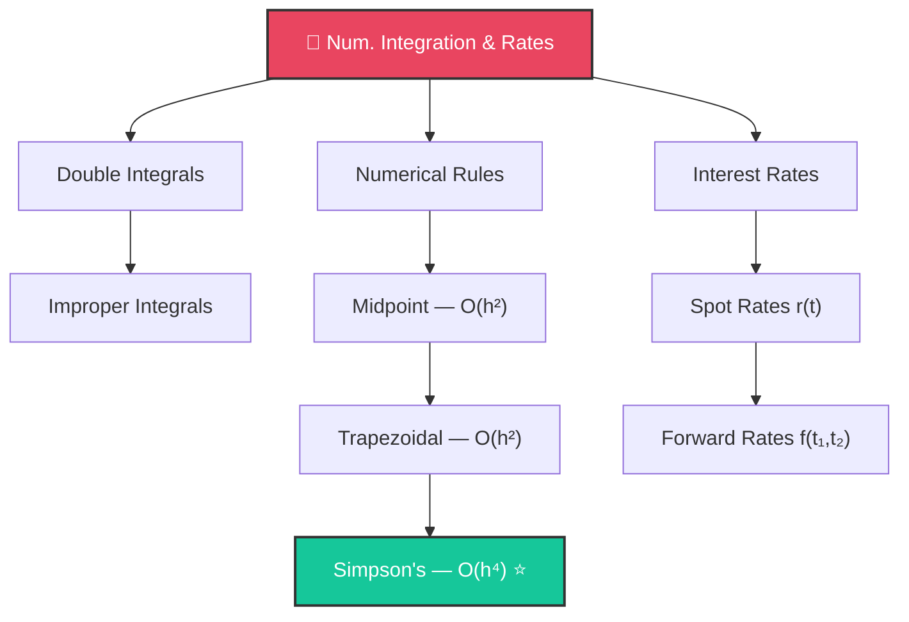

# 🔬 Day 4: Numerical Integration and Interest Rates

> [!target] **Goal**
> Learn the numerical integration machinery (midpoint, trapezoidal, Simpson's) and connect it to interest rate curve mathematics.

> [!nav] **Navigation**
> **← [[FE Day 03 - Options and Arbitrage-Free Pricing|Day 3: Options]]** | **Home:** [[FE Math Primer MOC|📐 Home]] | **Next → [[FE Day 05 - Bonds Duration Convexity|Day 5: Bonds]]**
> **Key Links:** [[Yield Curve Bootstrapping]]

---

## Concept Map

---

## Topics

### 1. Double and Improper Integrals

> [!money] Finance Connection
> $N(x) = \int_{-\infty}^{x} \varphi(t)\,dt$ is an improper integral — the backbone of BS

---

### 2. Numerical Integration Rules

> [!important] The Three Rules

| Rule | Error | Speed |
|------|-------|-------|
| **Midpoint** | $O(h^2)$ | ⚡ |
| **Trapezoidal** | $O(h^2)$ | ⚡ |
| **Simpson's** ⭐ | $O(h^4)$ | ⚡⚡⚡ |

> [!tip] Why Simpson's Wins
> Error drops **16×** per doubling of points (vs 4× for others)

---

### 3. Interest Rate Curves

> [!important] Spot ↔ Forward
> $$f(t_1, t_2) = \frac{r(t_2) \cdot t_2 - r(t_1) \cdot t_1}{t_2 - t_1}$$

---

## Interview Preparation

> [!question] **Q1: Integration Method Choice**
> *"1D pricing with no closed form — MC or quadrature?"*

> [!success] **Expected Answer**
> Simpson's beats MC for 1D/2D: $O(h^4)$ vs $O(1/\sqrt{N})$

---

## Exercises to Complete

- [ ] **Exercise 1:** Implement all three rules in Python
- [ ] **Exercise 2:** Compute $N(1.0)$ via Simpson's rule
- [ ] **Exercise 3:** Plot convergence rates experimentally
- [ ] **Exercise 4:** Given $r(1)=3\%, r(2)=4\%$, compute $f(1,2)$

---

## Study Materials

> [!abstract] **Study Materials**
> *Pseudocode from Stefanica Tables 2.1–2.4 to implement.*

---

#FE-primer #day-04 #numerical-methods #interest-rates #integration
