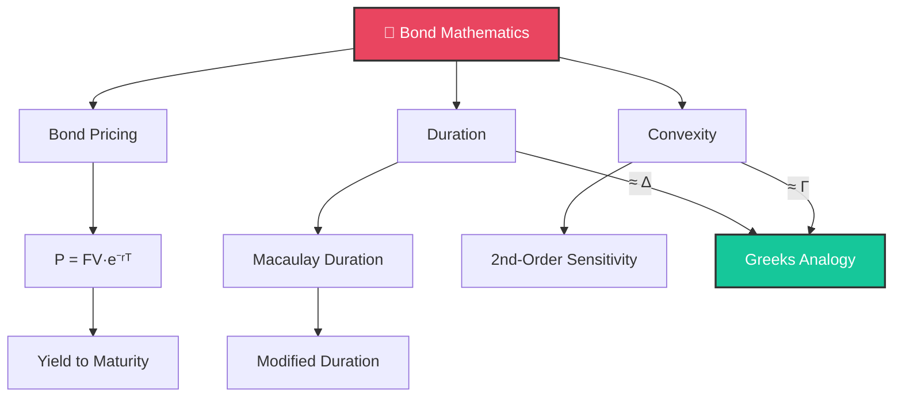

# 🏦 Day 5: Bonds, Duration, and Convexity

> [!target] **Goal**
> Master the mathematics of bond pricing, yield, duration, and convexity — the foundation of fixed income quant work.

> [!nav] **Navigation**
> **← [[FE Day 04 - Numerical Integration and Interest Rates|Day 4: Integration]]** | **Home:** [[FE Math Primer MOC|📐 Home]] | **Next → [[FE Day 06 - Probability and Black-Scholes|Day 6: Probability]]**
> **Key Links:** [[Bond Pricing Fundamentals]] · [[Duration and Convexity]]

---

## Concept Map

---

## Topics

### 1. Bond Pricing

> [!def] Coupon Bond
> $$P = \sum_{i=1}^{n} C \cdot e^{-r(t_i) \cdot t_i} + FV \cdot e^{-r(t_n) \cdot t_n}$$

---

### 2. Duration

> [!important] The Key Formula
> $$\frac{dP}{P} \approx -D_{\text{mod}} \cdot dy$$
> Duration is the bond's **interest rate beta**.

> [!tip] Intuition
> Duration = weighted average time to receive cash flows. Longer duration → more rate sensitivity.

---

### 3. Convexity

> [!important] Better Approximation
> $$\frac{dP}{P} \approx -D \cdot dy + \tfrac{1}{2}C \cdot (dy)^2$$

> [!tip] Key Insight
> Convexity is **always positive** for vanilla bonds → bonds outperform the linear approximation in **both** directions. This is the fixed income analogue of **Gamma** in options.

---

## Interview Preparation

> [!question] **Q1: Duration Price Sensitivity**
> *"Duration=5. Rates rise 50bp. Price change?"*

> [!success] **Expected Answer**
> $dP/P \approx -5 \times 0.005 = -2.5\%$

> [!question] **Q2: Bond Selection**
> *"Two bonds, same duration. Which do you prefer?"*

> [!success] **Expected Answer**
> Higher convexity — same first-order sensitivity but benefits more from large moves

> [!question] **Q3: Zero Coupon Bond Duration**
> *"Duration of a zero coupon bond?"*

> [!success] **Expected Answer**
> Equals maturity. Maximum duration for a given maturity.

> [!question] **Q4: Duration and Convexity Analogies**
> *"How is duration like delta, convexity like gamma?"*

> [!success] **Expected Answer**
> Both are Taylor expansion terms. Duration/Delta = first order. Convexity/Gamma = second order.

---

## Exercises to Complete

- [ ] **Exercise 1:** Price a 5yr 4% annual coupon bond with flat yield at 3%
- [ ] **Exercise 2:** Compute Macaulay & Modified duration
- [ ] **Exercise 3:** Compare $dP$ via duration vs actual for shifts of 10bp, 50bp, 100bp
- [ ] **Exercise 4:** Show convexity dramatically improves the large-shift approximation
- [ ] **Exercise 5:** Implement Stefanica pseudocode (Tables 2.5–2.7)

---

## Study Materials

> [!abstract] **Study Materials**
> *Populated during study.*

---

#FE-primer #day-05 #fixed-income #bonds #duration #convexity
