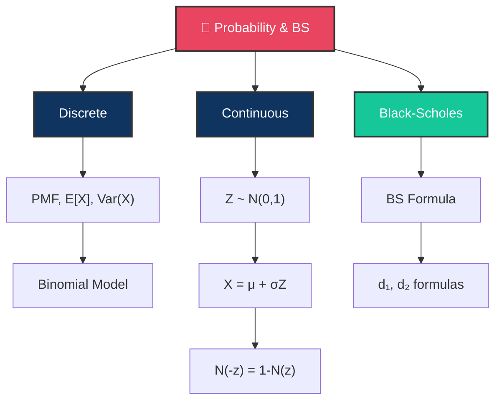

# 🎲 Day 6: Probability Concepts and the Black-Scholes Formula

> [!target]
> Build from discrete probability through continuous distributions to the most important formula in quant finance — Black-Scholes.

> [!nav]
> **← [[FE Day 05 - Bonds Duration Convexity|Day 5]]** | **Home:** [[FE Math Primer MOC|📐 Home]] | **Next → [[FE Day 07 - Greeks and Hedging|Day 7]]**

---

## Concept Map

---

## Discrete Probability

> [!def]
> **Probability Mass Function (PMF)**: $P(X = x)$ describes the probability of each discrete outcome.
>
> **Expectation**: $E[X] = \sum_x x \cdot P(X=x)$
>
> **Variance**: $\text{Var}(X) = E[X^2] - (E[X])^2$

> [!important]
> **Finance Connection**: The binomial tree model prices options using discrete probabilities at each node. This is your first stepping stone to continuous models.

---

## Continuous Probability

> [!def]
> **Probability Density Function (PDF)**: $f(x)$ where $P(a \le X \le b) = \int_a^b f(x)\,dx$
>
> **Expectation**: $E[X] = \int_{-\infty}^{\infty} x \cdot f(x)\,dx$
>
> **Variance & Covariance**: $\text{Var}(X) = E[X^2] - (E[X])^2$, $\text{Cov}(X,Y) = E[XY] - E[X]E[Y]$

> [!important]
> **Finance Connection**: Asset returns are modeled as continuous random variables. This is the foundation for all modern options pricing.

---

## The Standard Normal Variable

> [!def]
> **Standard Normal PDF**: $\varphi(z) = \frac{1}{\sqrt{2\pi}} e^{-z^2/2}$
>
> **Standard Normal CDF**: $N(z) = \int_{-\infty}^{z} \varphi(t)\,dt$

> [!important]
> **Key Properties**:
> - $N(-z) = 1 - N(z)$ (symmetry around zero)
> - $\varphi'(z) = -z \cdot \varphi(z)$ (derivative relationship)
> - $E[Z \cdot \mathbf{1}_{Z>a}] = \varphi(a)$ (truncated expectation — **crucial for BS derivation**)

---

## Normal Random Variables

> [!def]
> If $X \sim N(\mu, \sigma^2)$, then $X = \mu + \sigma Z$ where $Z \sim N(0,1)$.
>
> **Moment Generating Function**: $E[e^{tX}] = e^{\mu t + \sigma^2 t^2/2}$

> [!important]
> **Finance Connection**: Log-returns are assumed normal under the standard model, which makes prices lognormal. This is why we can't have negative stock prices.

---

## The Black-Scholes Formula

> [!money]
> **Black-Scholes Call Price**:
> $$C = S \cdot N(d_1) - K \cdot e^{-rT} \cdot N(d_2)$$
>
> Where:
> $$d_1 = \frac{\ln(S/K) + (r + \sigma^2/2)T}{\sigma\sqrt{T}}$$
> $$d_2 = d_1 - \sigma\sqrt{T}$$

> [!abstract]
> **At this stage**: You need to understand the formula structure and what each input means. The full derivation comes on Day 9. Think of this as the capstone formula for the probability foundation.
>
> **Connection**: [[Black-Scholes Framework]]

---

## Interview Questions

> [!question]
> **Q1**: "Write down the Black-Scholes formula."
>
> [!success]
> **Expected Answer**: Must be instant and accurate. Know the definition of $d_1$ and $d_2$ by heart.

> [!question]
> **Q2**: "What is $N(d_2)$ financially?"
>
> [!success]
> **Expected Answer**: $N(d_2)$ = risk-neutral probability that the option expires in-the-money.

> [!question]
> **Q3**: "What is $N(d_1)$?"
>
> [!success]
> **Expected Answer**: More subtle. $N(d_1)$ equals the delta of the call, and also $E^Q[S_T/S_0 \cdot \mathbf{1}_{S_T > K}] / e^{rT}$. It's related to the conditional expectation of $S_T$ given exercise. Deep dive on Day 9.

> [!question]
> **Q4**: "What's the Black-Scholes price of a call when $\sigma \to \infty$?"
>
> [!success]
> **Expected Answer**: $C \to S$ (the call becomes the stock itself). This is because $N(d_1) \to 1$ and $K \cdot e^{-rT} \cdot N(d_2) \to 0$ as volatility explodes.

---

## Exercises

- [ ] Derive $E[Z^2] = 1$ and $E[Z^4] = 3$ from the MGF of the standard normal
- [ ] Prove $N(-z) = 1 - N(z)$ using the symmetry of $\varphi(z)$
- [ ] Compute Black-Scholes call and put prices: $S=100$, $K=100$, $r=5\%$, $\sigma=20\%$, $T=1$
- [ ] Verify put-call parity holds for your computed values
- [ ] Implement the BS formula in Python (Stefanica Table 3.2)

---

## Study Notes

> [!abstract]
> *Populated during study.*

---

#FE-primer #day-06 #probability #black-scholes
