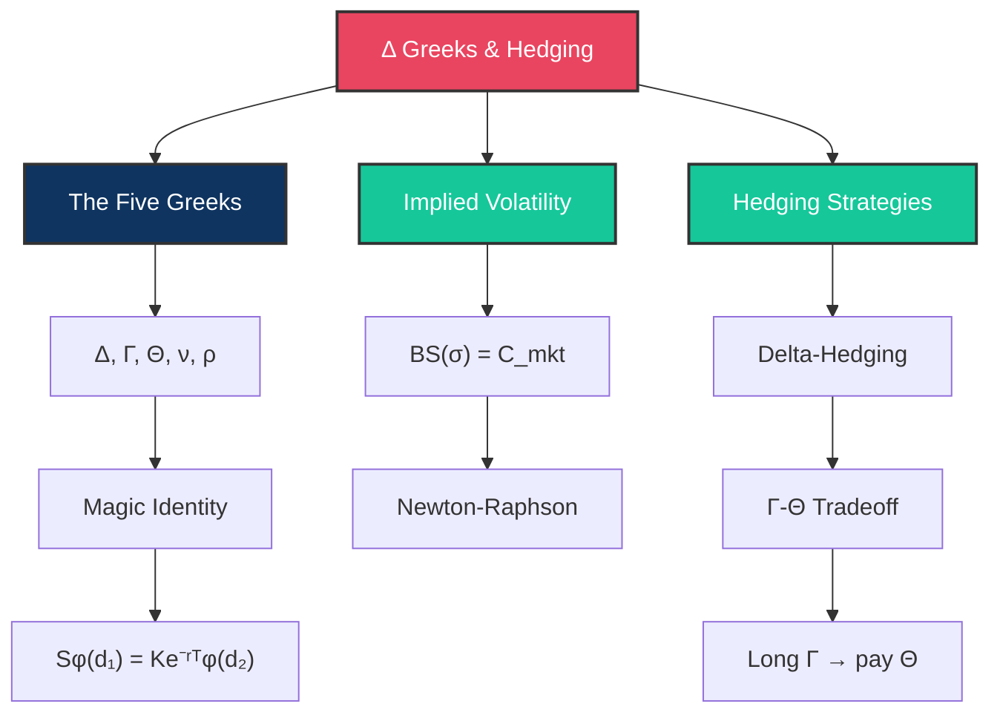

# Δ Day 7: The Greeks and Hedging

> [!target] **Goal**
> Compute every Greek analytically, understand implied volatility, and master delta-hedging and gamma-hedging strategies.

> [!nav] **Navigation**
> **← [[FE Day 06 - Probability and Black-Scholes|Day 6]]** | **Home:** [[FE Math Primer MOC|📐 Home]] | **Next → [[FE Day 08 - Lognormal Variables and Risk-Neutral Pricing|Day 8]]**
>
> **Key Links:** [[Delta]], [[Gamma]], [[Theta]], [[Vega]], [[Implied Volatility]]

---

## Concept Map

---

## Topics

### 1. Computing the Greeks

> [!def] **The Five Greeks**
> Sensitivities of the option value to market parameters:
>
> **Delta**: $\Delta = \frac{\partial C}{\partial S} = N(d_1)$ — rate of change of option value w.r.t. stock price
>
> **Gamma**: $\Gamma = \frac{\partial^2 C}{\partial S^2} = \frac{\varphi(d_1)}{S \cdot \sigma \cdot \sqrt{T}}$ — convexity of the option
>
> **Theta**: $\Theta = \frac{\partial C}{\partial t} = -\frac{S \cdot \varphi(d_1) \cdot \sigma}{2\sqrt{T}} - r \cdot K \cdot e^{-rT} \cdot N(d_2)$ — time decay
>
> **Vega**: $\nu = \frac{\partial C}{\partial \sigma} = S \cdot \varphi(d_1) \cdot \sqrt{T}$ — sensitivity to volatility
>
> **Rho**: $\rho = \frac{\partial C}{\partial r} = K \cdot T \cdot e^{-rT} \cdot N(d_2)$ — sensitivity to interest rates

> [!important] **The Magic Identity**
> When you differentiate the Black-Scholes formula, a crucial identity emerges:
> $$S \cdot \varphi(d_1) = K \cdot e^{-rT} \cdot \varphi(d_2)$$
> This relationship causes terms to cancel beautifully in Greek computations, making formulas tractable.

---

### 2. Implied Volatility

> [!def] **Implied Volatility (IV)**
> The volatility $\sigma_{IV}$ that makes the Black-Scholes model price equal the market-observed price.
>
> **Find $\sigma$ such that**: $BS(S, K, r, T, \sigma) = C_{\text{mkt}}$
>
> No closed form exists. Use **Newton-Raphson**:
> $$\sigma_{n+1} = \sigma_n - \frac{BS(\sigma_n) - C_{\text{mkt}}}{\text{Vega}(\sigma_n)}$$

> [!money] **Finance Connection**
> The BS price is monotonically increasing in $\sigma$ (because Vega $> 0$), ensuring fast convergence. Typically 3–5 iterations suffice.

---

### 3. Delta-Hedging

> [!def] **Delta-Hedging Strategy**
> Construct a riskless portfolio by combining the option with the stock:
> $$\Pi = V - \Delta \cdot S$$
>
> Where $\Delta = \partial V/\partial S$ is the option's delta.

> [!important] **How It Works**
> The derivative of the portfolio with respect to the stock price is:
> $$\frac{\partial \Pi}{\partial S} = \frac{\partial V}{\partial S} - \Delta = 0$$
>
> This eliminates the $dW$ term in the SDE, making the portfolio riskless (instantaneously).

> [!important] **The Reality**
> Must rebalance continuously (impossible in practice). Discrete rebalancing introduces hedging error proportional to:
> $$\text{Hedging Error} \propto \Gamma \times (\Delta S)^2$$
>
> High gamma stocks require frequent rebalancing; low gamma positions are forgiving.

---

### 4. Gamma-Theta Tradeoff

> [!def] **The Gamma-Theta Relationship**
> From the Black-Scholes PDE, for a delta-hedged portfolio:
> $$\Theta + \frac{1}{2}\sigma^2 S^2 \Gamma = rV$$

> [!important] **Interpretation**
> - If $\Gamma > 0$ (long option): Theta is negative → you pay time decay
> - If $\Gamma < 0$ (short option): Theta is positive → you earn time decay
>
> This is the fundamental tradeoff: **you cannot be long both gamma and theta simultaneously.**

> [!tip] **Gamma Scalping**
> If you own an option (long gamma), you dynamically rebalance to lock in profits from realized moves. You "scalp" the realized volatility but pay time decay. Profitable if $\text{realized vol} > \text{implied vol}$.

---

## Interview Preparation

> [!question] **Q1: Delta of a Deep ITM Call**
> "What is the delta of a deep ITM call?"
>
> [!success] **Expected Answer**
> Close to 1. In the limit as $S \gg K$, the call behaves like a forward contract, which has delta = 1.

> [!question] **Q2: Volatility Jump and Gamma**
> "You're delta-hedged. Volatility doubles overnight. Do you make or lose money?"
>
> [!success] **Expected Answer**
> Depends on gamma sign. If long gamma (long the option), you make money—the large move benefits your convexity. If short gamma, you lose.

> [!question] **Q3: Newton-Raphson for Implied Volatility**
> "Derive the Newton-Raphson iteration for implied volatility."
>
> [!success] **Expected Answer**
> $$\sigma_{n+1} = \sigma_n - \frac{BS(\sigma_n) - C_{\text{mkt}}}{\text{Vega}(\sigma_n)}$$

> [!question] **Q4: Gamma Scalping**
> "Why do traders say 'gamma scalping'?"
>
> [!success] **Expected Answer**
> Being long gamma means you buy low (rebalance when stock drops) and sell high (rebalance when stock rises). You profit from the spread, but you're paying theta for the privilege. Profitable if realized vol > implied vol.

---

## Exercises to Complete

- [ ] **Exercise 1:** Compute all five Greeks for: $S=100$, $K=105$, $r=3\%$, $\sigma=25\%$, $T=0.5$
- [ ] **Exercise 2:** Verify the Gamma-Theta relationship: $\Theta + \frac{1}{2}\sigma^2 S^2 \Gamma \approx rV$
- [ ] **Exercise 3:** Implement Newton-Raphson implied volatility solver in Python
- [ ] **Exercise 4:** Simulate delta-hedging a call over 100 paths and measure P&L distribution
- [ ] **Exercise 5:** Compute Greeks for a put using put-call parity relationships

---

## Study Materials

> [!abstract] **Study Notes**
> *Populated during study.*

---

#FE-primer #day-07 #greeks #hedging #implied-volatility
