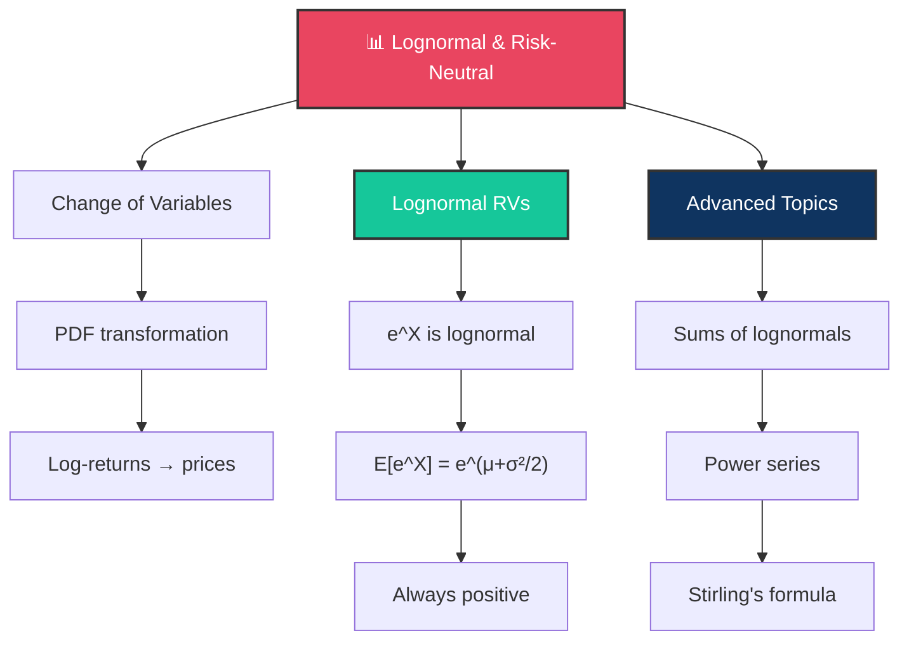

# 📊 Day 8: Lognormal Variables and Risk-Neutral Pricing

> [!target] **Goal**
> Understand why asset prices are modeled as lognormal, master change-of-variables for probability densities, and build the mathematical foundations of risk-neutral pricing.

> [!nav] **Navigation**
> **← [[FE Day 07 - Greeks and Hedging|Day 7]]** | **Home:** [[FE Math Primer MOC|📐 Home]] | **Next → [[FE Day 09 - Black-Scholes Derivation and N(d1) N(d2)|Day 9]]**
>
> **Key Links:** [[Geometric Brownian Motion]]

---

## Concept Map

---

## Topics

### 1. Change of Variables for PDFs

> [!def] **Change of Variables Transformation**
> If $Y = g(X)$ where $g$ is monotone (increasing or decreasing), the PDF transforms as:
> $$f_Y(y) = f_X(g^{-1}(y)) \cdot \left| \frac{d}{dy} g^{-1}(y) \right|$$

> [!important] **Finance Connection**
> This is how we answer: "If log-returns are normal, what is the distribution of prices?" The answer: prices follow a lognormal distribution.

---

### 2. Lognormal Random Variables

> [!def] **Lognormal Distribution**
> If $X \sim N(\mu, \sigma^2)$, then $S = e^X$ follows a **lognormal distribution**.
>
> **Mean**: $E[S] = e^{\mu + \sigma^2/2}$
>
> **Variance**: $\text{Var}[S] = e^{2\mu + \sigma^2}(e^{\sigma^2} - 1)$

> [!important] **Jensen's Inequality & the σ²/2 Correction**
> The $\sigma^2/2$ correction in the expectation is NOT optional.
>
> By **Jensen's Inequality** (exponential is convex):
> $$E[e^X] \geq e^{E[X]} = e^\mu$$
>
> The strict inequality reflects the convexity cost. Forgetting this term invalidates your return estimates.

> [!money] **Why Lognormal for Asset Prices**
> 1. Prices are always positive (cannot go below zero)
> 2. Returns compound multiplicatively: $S_T = S_0 \cdot e^{r_1 + r_2 + \cdots}$
> 3. Percentage returns are scale-invariant (a $1 stock and a $1000 stock behave identically in % terms)
>
> A normal model would allow negative prices—absurd in finance.

---

### 3. Independent Normal Variables

> [!def] **Sum of Independent Normals**
> If $X \sim N(\mu_X, \sigma_X^2)$ and $Y \sim N(\mu_Y, \sigma_Y^2)$ are independent, then:
> $$X + Y \sim N(\mu_X + \mu_Y, \sigma_X^2 + \sigma_Y^2)$$

> [!important] **Finance Connection**
> Multi-period log-returns are sums of single-period log-returns. Since each period's return is normal (under the model), the sum remains normal over any time horizon. This is why the normal model is so convenient for derivatives pricing.

---

### 4. Sums of Lognormals

> [!important] **Non-Additivity of Lognormal Variables**
> Unlike normal random variables, **sums of lognormal variables are NOT lognormal**.
>
> $$S_1 + S_2 \text{ is NOT lognormal if } S_1, S_2 \text{ are lognormal}$$

> [!def] **Why This Matters: Asian Options**
> Asian options (arithmetic average of prices) have no closed-form solution.
> $$\text{Payoff} = \left( \frac{1}{T}\int_0^T S_t \, dt - K \right)^+$$
>
> The average of lognormal samples has no tractable distribution.

> [!tip] **Approximation Methods**
> - **Moment Matching**: Match mean and variance to a lognormal
> - **Levy Approximation**: Use a shifted lognormal
> - **Monte Carlo**: Simulate paths directly (no closed form needed)

---

### 5. Power Series and Stirling's Formula

> [!code] **Exponential and Geometric Series**
> **Exponential Series**:
> $$e^x = \sum_{n=0}^{\infty} \frac{x^n}{n!} = 1 + x + \frac{x^2}{2!} + \frac{x^3}{3!} + \cdots$$
>
> **Geometric Series**:
> $$\frac{1}{1-x} = \sum_{n=0}^{\infty} x^n \quad \text{for } |x| < 1$$

> [!code] **Stirling's Approximation**
> $$n! \approx \sqrt{2\pi n} \left(\frac{n}{e}\right)^n$$
>
> For large $n$, this is extremely accurate. Useful for asymptotic analysis of the binomial model.

> [!tip] **Finance Connection**
> The binomial model with $n \to \infty$ converges to Black-Scholes. Stirling's formula appears in the combinatorial arguments needed to prove this convergence.

---

## Interview Preparation

> [!question] **Q1: Expected Stock Price with Lognormal Returns**
> "If log-returns are normally distributed with mean 10% and vol 20% over one year, what is the expected stock price if $S_0 = 100$?"
>
> [!success] **Expected Answer**
> $E[S_T] = S_0 \cdot e^{\mu T} = 100 \cdot e^{0.10 \cdot 1} = 100 \cdot e^{0.1} \approx 110.52$
>
> **Critical**: This is NOT $100 \cdot e^{0.10 - 0.5 \cdot 0.20^2} \approx 109.5$. The drift $\mu = 10\%$ already includes the final expected return; we don't subtract $\sigma^2/2$ when computing the expectation.

> [!question] **Q2: Jensen's Inequality and σ²/2**
> "Why is the $\sigma^2/2$ correction important? How does it arise?"
>
> [!success] **Expected Answer**
> Jensen's inequality: the exponential function is strictly convex, so $E[e^X] > e^{E[X]}$. The correction accounts for this convexity. Mathematically, it arises from the Taylor expansion or from computing the MGF:
> $$E[e^X] = \int e^x \cdot \varphi(x) \, dx = e^{\mu + \sigma^2/2}$$

> [!question] **Q3: Why Not Normal Prices?**
> "Why can't we model stock prices as normal random variables?"
>
> [!success] **Expected Answer**
> Two reasons:
> 1. Normal variables can be negative; stock prices cannot
> 2. Multiplicative returns (not additive) are the natural model—a $1 stock and a $1000 stock should have identical percentage return distributions

---

## Exercises to Complete

- [ ] **Exercise 1:** Derive $E[e^X] = e^{\mu + \sigma^2/2}$ using the MGF of the normal distribution
- [ ] **Exercise 2:** If $S_0 = 100$, $\mu = 8\%$, $\sigma = 30\%$, $T = 1$, compute $E[S_T]$, $\text{Median}[S_T]$, and $\text{Mode}[S_T]$
- [ ] **Exercise 3:** Show that $\text{Median}[S_T] < E[S_T]$ for lognormal (right-skewed distribution)
- [ ] **Exercise 4:** Approximate $20!$ using Stirling's formula and compare to the exact value

---

## Study Materials

> [!abstract] **Study Notes**
> *Populated during study.*

---

#FE-primer #day-08 #lognormal #risk-neutral
