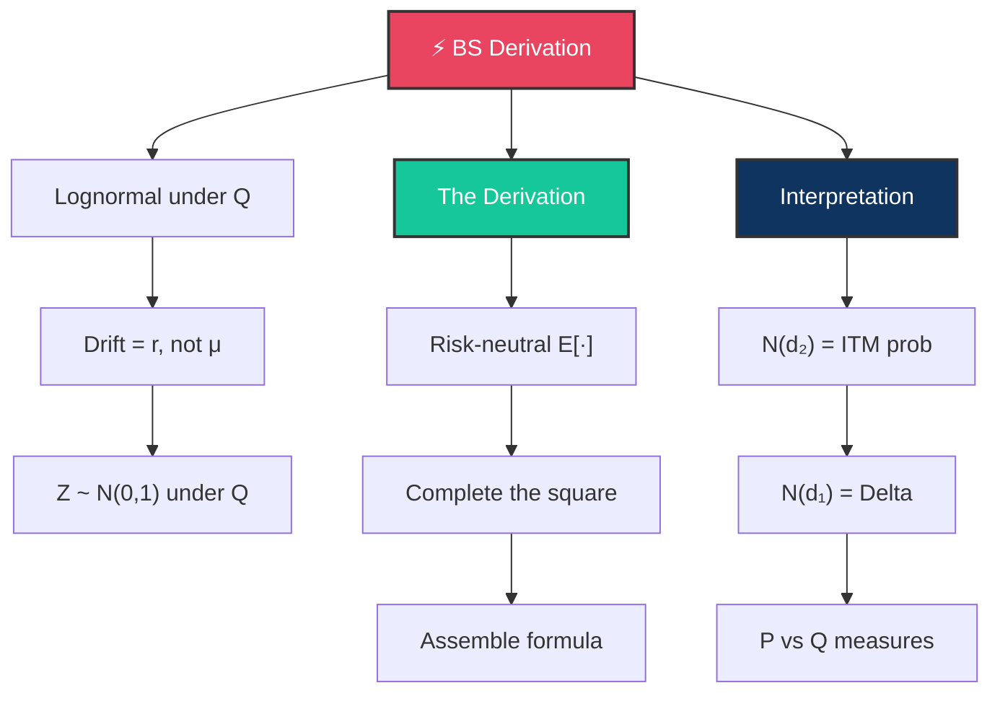

# ⚡ Day 9: Risk-Neutral Derivation of Black-Scholes

> [!target] **Goal**
> Derive Black-Scholes from first principles via risk-neutral pricing, and deeply understand what N(d₁) and N(d₂) actually represent financially.

> [!nav] **Navigation**
> **← [[FE Day 08 - Lognormal Variables and Risk-Neutral Pricing|Day 8]]** | **Home:** [[FE Math Primer MOC|📐 Home]] | **Next → [[FE Day 10 - Taylor Formula and Series|Day 10]]**
>
> **Key Links:** [[Risk-Neutral Pricing]], [[Black-Scholes Framework]]

---

## Concept Map

---

## Topics

### 1. The Lognormal Asset Model under Q

> [!def] **Stock Price under Risk-Neutral Measure**
> Under the risk-neutral measure $\mathbb{Q}$, the stock price follows:
> $$dS = r S \, dt + \sigma S \, dW^{\mathbb{Q}}$$
>
> **Solution** (by Itô):
> $$S_T = S_0 \cdot \exp\left(\left(r - \frac{\sigma^2}{2}\right)T + \sigma\sqrt{T} \cdot Z\right)$$
>
> where $Z \sim N(0,1)$.

> [!important] **Why the Drift is r, Not μ**
> This is the crux of risk-neutral pricing. Under the physical measure, the drift is $\mu$ (the true expected return). Under $\mathbb{Q}$, the Girsanov theorem transforms it to $r$ (the risk-free rate). This eliminates all directional risk from pricing.

---

### 2. The Derivation (The Core)

> [!important] **Master This Derivation**
> This is **the** interview question. You must be able to execute this derivation cleanly in 10 minutes.

#### Step 1: Risk-Neutral Expectation

$$C = e^{-rT} \cdot \mathbb{E}^{\mathbb{Q}}[\max(S_T - K, 0)]$$

#### Step 2: Change of Variables

Let $Z \sim N(0,1)$ be the standard normal. Then:

$$S_T = S_0 \cdot e^{(r - \sigma^2/2)T + \sigma\sqrt{T} \cdot Z}$$

The option pays off when $S_T > K$:

$$S_0 \cdot e^{(r - \sigma^2/2)T + \sigma\sqrt{T} \cdot z} > K$$

Taking logs:

$$z > \frac{\ln(K/S_0) - (r - \sigma^2/2)T}{\sigma\sqrt{T}} = -d_2$$

#### Step 3: Split the Integral

$$C = e^{-rT} \int_{-d_2}^{\infty} \left(S_0 e^{(r - \sigma^2/2)T + \sigma\sqrt{T} \cdot z} - K\right) \varphi(z) \, dz$$

$$= e^{-rT} \left[ S_0 e^{(r - \sigma^2/2)T} \int_{-d_2}^{\infty} e^{\sigma\sqrt{T} \cdot z} \varphi(z) \, dz - K \int_{-d_2}^{\infty} \varphi(z) \, dz \right]$$

#### Step 4: Complete the Square (First Integral)

For the first integral, complete the square in the exponential:

$$e^{\sigma\sqrt{T} \cdot z} \cdot \varphi(z) = e^{\sigma\sqrt{T} \cdot z} \cdot \frac{1}{\sqrt{2\pi}} e^{-z^2/2}$$

$$= \frac{1}{\sqrt{2\pi}} \exp\left(\sigma\sqrt{T} \cdot z - \frac{z^2}{2}\right)$$

$$= \frac{1}{\sqrt{2\pi}} \exp\left(-\frac{1}{2}(z - \sigma\sqrt{T})^2 + \frac{\sigma^2 T}{2}\right)$$

$$= e^{\sigma^2 T/2} \cdot \varphi(z - \sigma\sqrt{T})$$

#### Step 5: Recognize Normal CDFs

Let $w = z - \sigma\sqrt{T}$. Then:

$$\int_{-d_2}^{\infty} e^{\sigma\sqrt{T} \cdot z} \varphi(z) \, dz = e^{\sigma^2 T/2} \int_{-d_2 - \sigma\sqrt{T}}^{\infty} \varphi(w) \, dw = e^{\sigma^2 T/2} \cdot N(d_2 + \sigma\sqrt{T}) = e^{\sigma^2 T/2} \cdot N(d_1)$$

And the second integral is simply $N(d_2)$.

#### Step 6: Assemble

$$C = e^{-rT} \left[ S_0 e^{(r - \sigma^2/2)T} \cdot e^{\sigma^2 T/2} \cdot N(d_1) - K \cdot N(d_2) \right]$$

$$= e^{-rT} \left[ S_0 e^{rT} \cdot N(d_1) - K \cdot N(d_2) \right]$$

$$= S_0 \cdot N(d_1) - K \cdot e^{-rT} \cdot N(d_2)$$

> [!success]
> **Black-Scholes Formula Derived! ✓**

---

### 3. N(d₂) as ITM Probability

> [!def] **N(d₂) = Risk-Neutral ITM Probability**
> **N(d₂) = Risk-Neutral Probability that the call expires In-The-Money:**
> $$N(d_2) = \mathbb{P}^{\mathbb{Q}}(S_T > K)$$

> [!important] **Personal Beliefs vs. Risk-Neutral Price**
> The option does NOT care about your personal view ($\mu$) of the stock's future. The pricing uses the risk-neutral drift $r$, which depends only on the risk-free rate.
>
> Under the physical measure $\mathbb{P}$, the ITM probability is:
> $$\mathbb{P}^{\mathbb{P}}(S_T > K) = N\left(d_2 + \frac{(\mu - r)\sqrt{T}}{\sigma}\right)$$
>
> This shows how your actual belief about returns ($\mu$) affects the real-world probability, but NOT the price.

---

### 4. N(d₁) as Delta & Conditional Expectation

> [!def] **N(d₁) is the Delta**
> **N(d₁) is the Delta**:
> $$\Delta = \frac{\partial C}{\partial S_0} = N(d_1)$$
>
> **N(d₁) is a Conditional Expectation** (under the stock-price measure):
> $$S_0 \cdot N(d_1) = e^{-rT} \cdot \mathbb{E}^{\mathbb{Q}}[S_T \cdot \mathbf{1}_{S_T > K}]$$
>
> Rearranging:
> $$N(d_1) = \frac{e^{-rT}}{S_0} \cdot \mathbb{E}^{\mathbb{Q}}[S_T \cdot \mathbf{1}_{S_T > K}]$$

> [!important] **Why N(d₁) > N(d₂)**
> **N(d₁) > N(d₂) Always** (because $d_1 = d_2 + \sigma\sqrt{T} > d_2$).
>
> **Intuition**: The stock-price measure (weighting outcomes by realized stock price) puts more weight on states where $S$ is high. In high-$S$ states, the option is more likely to expire ITM. Hence the stock-price-weighted ITM probability exceeds the unweighted ITM probability.

---

### 5. P vs Q Measures for ITM Probability

> [!def] **Two Different Probabilities**
> **Risk-Neutral (Q-Measure) ITM Probability** — Used for pricing:
> $$\mathbb{P}^{\mathbb{Q}}(S_T > K) = N(d_2)$$
>
> **Physical (P-Measure) ITM Probability** — Your actual forecast:
> $$\mathbb{P}^{\mathbb{P}}(S_T > K) = N\left(d_2 + \frac{(\mu - r)\sqrt{T}}{\sigma}\right)$$

> [!tip] **Subtle Interview Point: Why Deep OTM Options Have Value**
> A deep out-of-the-money (OTM) option can have $N(d_2) \approx 0$ (nearly zero risk-neutral ITM probability) but still command significant value. Why?
>
> Because under the physical measure, if you believe $\mu > r$ (the stock will outperform the risk-free rate), the real ITM probability is:
> $$\mathbb{P}^{\mathbb{P}}(S_T > K) = N\left(d_2 + \frac{(\mu - r)\sqrt{T}}{\sigma}\right) > N(d_2)$$
>
> This captures tail risk and your actual beliefs, even when risk-neutral pricing suppresses the probability.

---

## Interview Preparation

> [!question] **Q1: Derive Black-Scholes from Scratch**
> "Derive the Black-Scholes formula from scratch."
>
> [!success] **Expected Answer**
> Walk through all six steps above. Cleanly execute the change of variables, complete-the-square technique, and recognize the normal CDF. This is **the** core derivation.

> [!question] **Q2: Why Does μ Disappear?**
> "Why does the drift $\mu$ disappear from the Black-Scholes formula?"
>
> [!success] **Expected Answer**
> Two equivalent views:
> 1. **Replication Argument**: By constructing a delta-hedged portfolio, directional risk is eliminated. Only the risk-free rate matters.
> 2. **Girsanov Theorem**: The change of measure from $\mathbb{P}$ to $\mathbb{Q}$ transforms the drift from $\mu$ to $r$.

> [!question] **Q3: Interpret the Black-Scholes Terms**
> "Interpret the two terms in $C = S \cdot N(d_1) - K \cdot e^{-rT} \cdot N(d_2)$."
>
> [!success] **Expected Answer**
> - $S \cdot N(d_1)$ = Present value of expected stock delivery in exercise states (weighted by stock-price measure)
> - $K \cdot e^{-rT} \cdot N(d_2)$ = Present value of expected cash outflow (strike × risk-neutral ITM probability)

> [!question] **Q4: Is N(d₁) Always Greater than N(d₂)?**
> "Is N(d₁) always greater than N(d₂)? Prove it."
>
> [!success] **Expected Answer**
> Yes. Since $d_1 = d_2 + \sigma\sqrt{T}$ and the CDF $N$ is increasing, $N(d_1) > N(d_2)$. Intuitively: the stock-price measure (where we weight outcomes by how high S goes) assigns higher probability to exercise than the unweighted measure.

---

## Exercises to Complete

- [ ] **Exercise 1:** Derive the Black-Scholes formula step-by-step **in under 10 minutes**. Time yourself.
- [ ] **Exercise 2:** Show that $z^* = -d_2$ by solving $S_0 \cdot \exp\left((r - \sigma^2/2)T + \sigma\sqrt{T} \cdot z\right) = K$
- [ ] **Exercise 3:** Verify numerically: Compute $N(d_2)$ from your Day 6 BS calculation. Then run a Monte Carlo simulation (10,000 paths) and compute $\mathbb{P}^{\mathbb{Q}}(S_T > K)$. They should match.
- [ ] **Exercise 4:** Compute the "real-world" probability of ITM for $S=100$, $K=100$, $r=5\%$, $\mu=10\%$, $\sigma=20\%$, $T=1$. Compare to risk-neutral ITM.
- [ ] **Exercise 5:** Show algebraically: $S \cdot N(d_1) = e^{-rT} \cdot \mathbb{E}^{\mathbb{Q}}[S_T \cdot \mathbf{1}_{S_T > K}]$ by direct computation of the integral.

---

## Study Materials

> [!abstract] **Study Notes**
> *Populated during study.*

---

#FE-primer #day-09 #black-scholes #derivation
