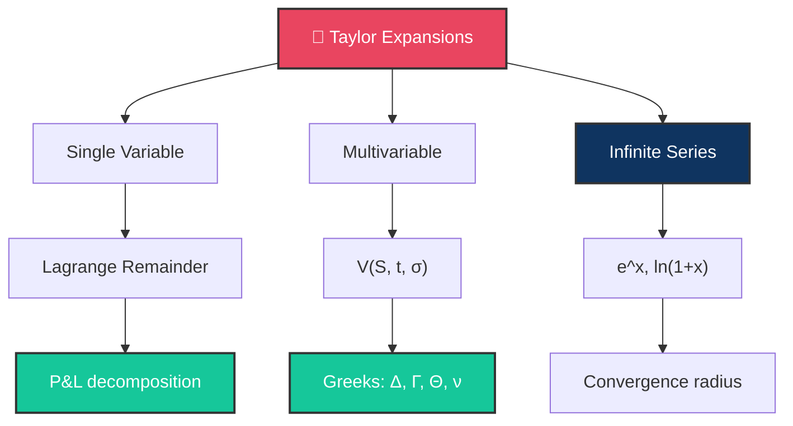

# 📐 Day 10: Taylor's Formula and Taylor Series

> [!target] **Goal**
> Master Taylor expansions — the universal tool for approximations, Greeks derivations, and understanding how option prices change.

> [!nav] **Navigation**
> **← [[FE Day 09 - Black-Scholes Derivation and N(d1) N(d2)|Day 9]]** | **Home:** [[FE Math Primer MOC|📐 Home]] | **Next → [[FE Day 11 - Taylor Applications to Finance|Day 11]]**

---

## Concept Map

---

## Topics

### 1. Taylor's Formula — One Variable

> [!def] **Taylor's Theorem (Single Variable)**
> $$f(x) = f(a) + f'(a)(x-a) + \frac{f''(a)}{2!}(x-a)^2 + \cdots + \frac{f^{(n)}(a)}{n!}(x-a)^n + R_n$$

> [!important] **Remainder Forms**
> - **Lagrange**: $R_n = \frac{f^{(n+1)}(c)}{(n+1)!}(x-a)^{n+1}$ for some $c \in (a, x)$
> - **Integral**: $R_n = \int_a^x \frac{f^{(n+1)}(t)}{n!}(x-t)^n dt$

> [!money] **Finance Connection: Portfolio P&L**
> P&L of an option portfolio: $\Delta \delta S + \frac{1}{2}\Gamma(\delta S)^2 + \Theta \delta t + \cdots$
>
> This **is a Taylor expansion** with respect to stock and time changes.

### 2. Taylor's Formula — Two Variables

> [!def] **Taylor's Theorem (Multivariable)**
> $$f(x+h, y+k) = f(x,y) + f_x \cdot h + f_y \cdot k + \frac{1}{2}(f_{xx}h^2 + 2f_{xy}hk + f_{yy}k^2) + \cdots$$

> [!money] **Option Price Changes**
> $$\delta V \approx \Delta \cdot \delta S + \Theta \cdot \delta t + \frac{1}{2}\Gamma \cdot (\delta S)^2 + \cdots$$
>
> Option price depends on spot ($S$) and time ($t$) — multivariable Taylor applies directly.

### 3. Taylor Series (Infinite)

> [!def] **Taylor Series Representation**
> When convergent: $f(x) = \sum_{n=0}^{\infty} \frac{f^{(n)}(a)}{n!}(x-a)^n$

> [!important] **Key Examples**
> - **Exponential**: $e^x = 1 + x + \frac{x^2}{2!} + \frac{x^3}{3!} + \cdots$ (converges everywhere)
> - **Logarithm**: $\ln(1+x) = x - \frac{x^2}{2} + \frac{x^3}{3} - \cdots$ (for $|x| < 1$)
> - **Binomial**: $(1+x)^{\alpha} = 1 + \alpha x + \frac{\alpha(\alpha-1)}{2!}x^2 + \cdots$

> [!def] **Radius of Convergence**
> $$R = \frac{1}{\limsup |a_n|^{1/n}}$$
> Determines the interval where the series equals the function.

---

## Interview Preparation

> [!question] **Q1: Portfolio P&L Approximation**
> "You're long a call. The stock moves by $\delta S$. Approximate your P&L."

> [!success] **Expected Answer**
> $$\text{P&L} \approx \Delta \cdot \delta S + \frac{1}{2}\Gamma \cdot (\delta S)^2 + \Theta \cdot \delta t$$
>
> - **Small moves**: Dominated by Delta
> - **Large moves**: Gamma becomes significant (convexity matters)

> [!question] **Q2: When Taylor Breaks Down**
> "When does the Taylor approximation break down for option pricing?"

> [!success] **Expected Answer**
> When $(\delta S)^2$ is large relative to $S^2$ — **gap openings, flash crashes, jumps**.
>
> Third and higher-order terms become material. Black-Scholes assumes continuous, small moves; Taylor captures this locally.

---

## Exercises to Complete

- [ ] **Exercise 1:** Expand $e^x$ to 5th order around $x=0$. Compute $e^{0.1}$ and compare to exact value.
- [ ] **Exercise 2:** Taylor expand $\ln(S_T/S_0)$ around $S_T = S_0$ (relates to log-returns).
- [ ] **Exercise 3:** Write the 2nd-order Taylor expansion of $V(S+\delta S, t+\delta t)$ in terms of Greeks.
- [ ] **Exercise 4:** **Challenge** — Derive the ATM call approximation $C_{\text{ATM}} \approx \frac{S \cdot \sigma \cdot \sqrt{T}}{\sqrt{2\pi}}$

---

## Study Materials

> [!abstract] **Study Notes**
> *Populated during study. Use this space for worked examples and key insights.*

---

#FE-primer #day-10 #taylor #approximation
