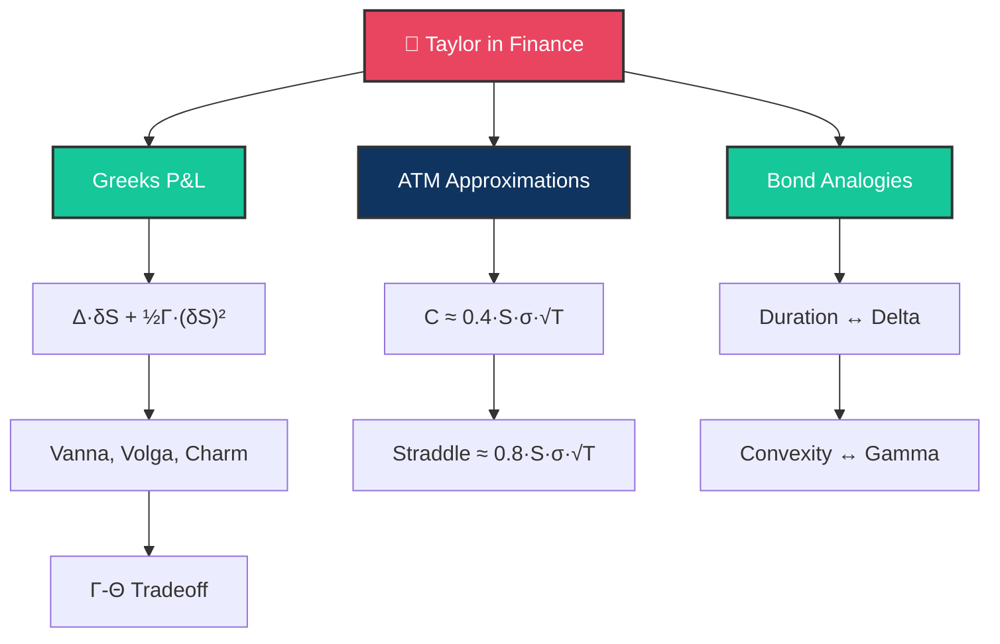

# 🎯 Day 11: Taylor Applications to Finance

> [!target] **Goal**
> Apply Taylor's formula to derive Greeks relationships, ATM approximations for Black-Scholes, and connect duration-convexity to Taylor.

> [!nav] **Navigation**
> **← [[FE Day 10 - Taylor Formula and Series|Day 10]]** | **Home:** [[FE Math Primer MOC|📐 Home]] | **Next → [[FE Day 12 - Finite Differences and Black-Scholes PDE|Day 12]]**
> **Key Links:** [[Second-Order Greeks]], [[Duration and Convexity]]

---

## Concept Map

---

## Topics

### 1. Greeks and Taylor's Formula

> [!important] P&L Decomposition
> $$\delta V = \frac{\partial V}{\partial S}\delta S + \frac{\partial V}{\partial t}\delta t + \frac{1}{2}\frac{\partial^2 V}{\partial S^2}(\delta S)^2 + \frac{\partial V}{\partial \sigma}\delta \sigma + \text{cross-terms}$$
>
> $$= \Delta \cdot \delta S + \Theta \cdot \delta t + \frac{1}{2}\Gamma \cdot (\delta S)^2 + \nu \cdot \delta \sigma + \cdots$$

> [!def] Second-Order Greeks
> - **Vanna**: $\frac{\partial^2 V}{\partial S \partial \sigma}$ — sensitivity to spot-vol correlation
> - **Volga**: $\frac{\partial^2 V}{\partial \sigma^2}$ — convexity in volatility
> - **Charm**: $\frac{\partial^2 V}{\partial S \partial t}$ — delta decay over time

> [!tip] Why This Matters
> A delta-neutral portfolio still has risk from Gamma (realized vol), Vega (implied vol), and Theta (time decay). Understanding these Greeks via Taylor is essential for risk management.

---

### 2. ATM Approximations for Black-Scholes

> [!def] ATM Forward Condition
> For $S = K e^{-rT}$ (ATM forward):
> - $d_1 = \frac{\sigma\sqrt{T}}{2}$
> - $d_2 = -\frac{\sigma\sqrt{T}}{2}$

> [!money] Key ATM Formulas
> $$C_{\text{ATM}} \approx \frac{S \cdot \sigma\sqrt{T}}{\sqrt{2\pi}} \approx 0.4 \cdot S \cdot \sigma \cdot \sqrt{T}$$
>
> **Trader's Rule**: Straddle $\approx 0.8 \cdot S \cdot \sigma \cdot \sqrt{T}$

> [!success] Why This Matters in Interviews
> Quick mental math for sanity checks. Given $S=100, \sigma=20\%, T=0.25$:
> $$C \approx 0.4 \times 100 \times 0.20 \times 0.5 = \$4.00$$
> (Exact BS: ~$3.99)

> [!question] Q: How precise is the approximation?
> **Answer**: Excellent for ATM, but error grows for deep ITM/OTM or when $\sigma\sqrt{T}$ is large. Higher-order Taylor terms quantify the error.

---

### 3. Precision of ATM Approximations

> [!abstract] Error Analysis
> The approximation $C_{\text{ATM}} \approx 0.4 \cdot S \cdot \sigma \cdot \sqrt{T}$ is first-order in the Taylor expansion.
>
> Stefanica 5.5.1 provides refined approximations of increasing precision. The error typically scales as $O((\sigma\sqrt{T})^3)$.

---

### 4. Duration-Convexity Connection

> [!important] Bond Price Changes
> $$\Delta P \approx -D \cdot P \cdot \Delta y + \frac{1}{2}C \cdot P \cdot (\Delta y)^2$$

> [!important] Option Price Changes
> $$\Delta V \approx \Delta \cdot \Delta S + \frac{1}{2}\Gamma \cdot (\Delta S)^2$$

> [!success] Same Math, Different Domain
> - **Bond**: Duration $\leftrightarrow$ Delta, Convexity $\leftrightarrow$ Gamma
> - **Both**: Second-order Taylor expansions
> - **Both**: Convexity/Gamma benefit from large moves (positive carry)

> [!tip] Interview Connection
> Understanding that bonds and options use identical mathematics (just applied to yield vs spot) demonstrates deep fluency.

---

## Interview Preparation

> [!question] **Q1: ATM Call Valuation**
> "Quick — an ATM call with $S=\$100, \sigma=20\%, T=0.25$ years. Ballpark the price."

> [!success] Answer
> $$C \approx 0.4 \times 100 \times 0.20 \times \sqrt{0.25} = 0.4 \times 100 \times 0.20 \times 0.5 = \$4.00$$
> Exact BS: ~$3.99 ✓

> [!question] **Q2: Greeks After Hedging**
> "Your book is delta-neutral and gamma-neutral. What risks remain?"

> [!success] Answer
> - **Vega risk**: Vol changes (important if vol assumptions are wrong)
> - **Theta**: Time decay (typically benefits short gamma positions)
> - **Higher-order Greeks**: Vanna, Volga (second-order in vol changes)
> - **Gap risk**: Jump risk that Taylor expansion cannot capture

> [!question] **Q3: Bond Convexity ↔ Option Gamma**
> "What's the connection between bond convexity and option gamma?"

> [!success] Answer
> Both are second derivatives from Taylor expansion. Both measure breakdown of linear approximation for large moves. Both benefit (positive carry) from large moves.

---

## Exercises to Complete

- [ ] **Exercise 1:** Compute ATM call approximation for $S=50, \sigma=30\%, T=1$ and compare to exact BS
- [ ] **Exercise 2:** Compute the error of the first-order ATM approximation as a function of $\sigma\sqrt{T}$
- [ ] **Exercise 3:** Show that for a delta-hedged portfolio, daily P&L $\approx \frac{1}{2}\Gamma(\delta S)^2 + \Theta \delta t$
- [ ] **Exercise 4:** Verify the duration-convexity approximation for a bond with $\Delta y = 200$ bp

---

## Study Materials

> [!abstract] **Study Materials**
> Populated during study. Link to [[Second-Order Greeks]] and [[Duration and Convexity]] for deeper dives.

---

#FE-primer #day-11 #taylor #ATM-approximation #greeks
