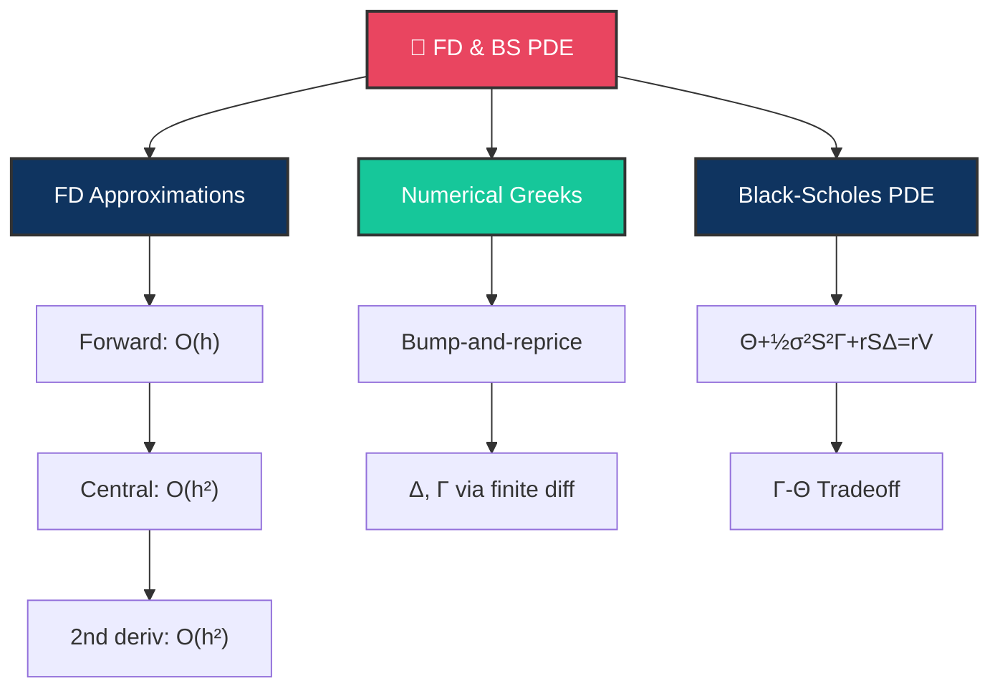

# 🔲 Day 12: Finite Differences and the Black-Scholes PDE

> [!target] **Goal**
> Learn how to approximate derivatives numerically (finite differences), derive the Black-Scholes PDE, and understand it as the backbone of derivative pricing.

> [!nav] **Navigation**
> **← [[FE Day 11 - Taylor Applications to Finance|Day 11]]** | **Home:** [[FE Math Primer MOC|📐 Home]] | **Next → [[FE Day 13 - Multivariable Calculus for Finance|Day 13]]**
> **Key Links:** [[Finite Difference Methods]]

---

## Concept Map

---

## Topics

### 1. Finite Difference Approximations

> [!def] Forward Difference
> $$f'(x) \approx \frac{f(x+h) - f(x)}{h}, \quad \text{Error: } O(h)$$

> [!def] Backward Difference
> $$f'(x) \approx \frac{f(x) - f(x-h)}{h}, \quad \text{Error: } O(h)$$

> [!important] Central Difference (Preferred)
> $$f'(x) \approx \frac{f(x+h) - f(x-h)}{2h}, \quad \text{Error: } O(h^2)$$
>
> **Why**: Same cost (2 evaluations) as forward, but **quadratically accurate**.

> [!def] Second Derivative
> $$f''(x) \approx \frac{f(x+h) - 2f(x) + f(x-h)}{h^2}, \quad \text{Error: } O(h^2)$$

> [!tip] Derivation
> Subtract backward Taylor from forward Taylor:
> - Forward: $f(x+h) = f(x) + f'(x)h + \frac{1}{2}f''(x)h^2 + O(h^3)$
> - Backward: $f(x-h) = f(x) - f'(x)h + \frac{1}{2}f''(x)h^2 + O(h^3)$
> - Subtract: $f(x+h) - f(x-h) = 2f'(x)h + O(h^3)$ ✓

---

### 2. Numerical Greeks

> [!money] Bump-and-Reprice
> When you have a pricing function $V(S)$ but no analytical Greeks:
>
> $$\Delta \approx \frac{V(S+h) - V(S-h)}{2h}$$
> $$\Gamma \approx \frac{V(S+h) - 2V(S) + V(S-h)}{h^2}$$

> [!important] Choosing $h$
> - **Too small**: Rounding error dominates
> - **Too large**: Truncation error dominates
> - **Rule of thumb**: $h \approx S \times 10^{-4}$ for double precision

> [!success] When to Use
> **Exotic options** without closed-form Greeks (path-dependent, American, barriers, etc.).
>
> Monte Carlo simulation: price with $S$ and $S+h$ independently, then compute the difference.

---

### 3. The Black-Scholes PDE

> [!important] Derivation Steps
> 1. Construct replicating portfolio: $\Pi = V - \Delta \cdot S$
> 2. Apply Itô's lemma to find $dV$
> 3. Choose $\Delta = \frac{\partial V}{\partial S}$ to eliminate randomness
> 4. No-arbitrage: $d\Pi = r\Pi \, dt$
> 5. **Result**:

> [!def] The Black-Scholes PDE
> $$\frac{\partial V}{\partial t} + \frac{1}{2}\sigma^2 S^2 \frac{\partial^2 V}{\partial S^2} + rS \frac{\partial V}{\partial S} - rV = 0$$

> [!money] Financial Interpretation (in Greeks)
> $$\boxed{\Theta + \frac{1}{2}\sigma^2 S^2 \Gamma + rS\Delta = rV}$$
>
> This is the **Greeks Constraint**:
> - $\Theta$ = time decay
> - $\frac{1}{2}\sigma^2 S^2 \Gamma$ = gamma p&l from realized vol
> - $rS\Delta$ = cost of carrying stock position
> - $rV$ = opportunity cost (what you'd earn in a risk-free bond)

> [!tip] The Gamma-Theta Tradeoff
> For a **delta-hedged** position, the PDE becomes:
> $$\Theta + \frac{1}{2}\sigma^2 S^2 \Gamma = 0$$
>
> Time decay is **exactly offset** by gamma gains (if realized vol = implied vol).

---

## Interview Preparation

> [!question] **Q1: Derive the Black-Scholes PDE**
> Be fluent. Start from replicating portfolio, use Itô's lemma, eliminate dW term.

> [!success] Model Answer
> Portfolio $\Pi = V - \Delta S$. By Itô: $dV = V_t dt + V_S dS + \frac{1}{2}V_{SS}(dS)^2$.
>
> Choose $\Delta = V_S$ so: $d\Pi = (V_t + \frac{1}{2}\sigma^2 S^2 V_{SS}) dt$.
>
> No-arbitrage: $d\Pi = r\Pi dt \Rightarrow V_t + \frac{1}{2}\sigma^2 S^2 V_{SS} + rS V_S - rV = 0$ ✓

> [!question] **Q2: Greeks Relationship**
> "What does the BS PDE tell you about Greeks?"

> [!success] Answer
> $$\Theta + \frac{1}{2}\sigma^2 S^2 \Gamma = r(V - S\Delta)$$
>
> For delta-hedged: $\Theta = -\frac{1}{2}\sigma^2 S^2 \Gamma$. Time decay exactly offsets gamma gains when realized vol = implied vol.

> [!question] **Q3: Numerical Greeks for Exotics**
> "How would you compute delta for a path-dependent exotic with no closed form?"

> [!success] Answer
> **Bump-and-reprice**: Run Monte Carlo with spot $S$ and $S+h$, compute the difference divided by $h$.
>
> Careful: need independent paths (same random seed), re-compute the entire path history with new spot.

> [!question] **Q4: Forward vs Central Differences**
> "Which do you use for Greeks and why?"

> [!success] Answer
> **Central**: $O(h^2)$ accuracy. Same computational cost as forward ($O(h)$), but better accuracy.
>
> Rule: Always use central unless you have a reason not to.

---

## Exercises to Complete

- [ ] **Exercise 1:** Derive central difference formula from Taylor (subtract forward and backward expansions)
- [ ] **Exercise 2:** Compute numerical delta and gamma for a BS call, compare to analytical values
- [ ] **Exercise 3:** Plot numerical delta error vs $h$ to find optimal $h$ (balance truncation vs rounding)
- [ ] **Exercise 4:** Derive the BS PDE step-by-step from the replicating portfolio argument
- [ ] **Exercise 5:** Verify $\Theta + \frac{1}{2}\sigma^2 S^2 \Gamma + rS\Delta = rV$ numerically for a BS call

---

## Study Materials

> [!abstract] **Study Materials**
> Populated during study. Reference [[Finite Difference Methods]] for more advanced techniques.
>
> Key insight: The BS PDE links all Greeks together. Mastering this relationship is essential for risk management.

---

#FE-primer #day-12 #finite-differences #PDE #black-scholes
