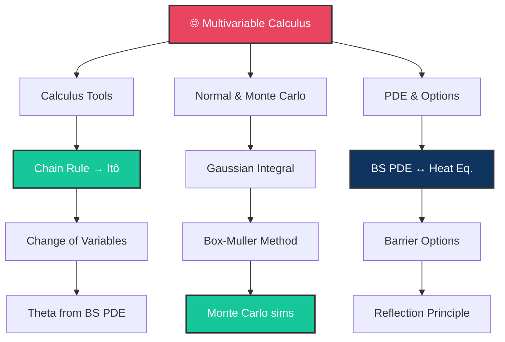

# 🌐 Day 13: Multivariable Calculus for Finance

> [!target] **Goal**
> Chain rule for multiple variables, change of variables in integrals, the Box-Muller method, the connection between BS PDE and the heat equation, and barrier option pricing.

> [!nav] **Navigation**
> **← [[FE Day 12 - Finite Differences and Black-Scholes PDE|Day 12]]** | **Home:** [[FE Math Primer MOC|📐 Home]] | **Next → [[FE Day 14 - Optimization and Numerical Methods|Day 14]]**
> **Key Links:** [[Monte Carlo Methods]], [[Barrier Options]]

---

## Concept Map



---

## Topics

### 1. Chain Rule for Several Variables

> [!def] The Chain Rule
> If $z = f(x(t), y(t))$, then:
> $$\frac{dz}{dt} = \frac{\partial f}{\partial x}\frac{dx}{dt} + \frac{\partial f}{\partial y}\frac{dy}{dt}$$

> [!important] Multivariable Extension
> If $z = f(x_1(t), \ldots, x_n(t))$:
> $$\frac{dz}{dt} = \sum_{i=1}^n \frac{\partial f}{\partial x_i}\frac{dx_i}{dt}$$

> [!money] Finance: Itô's Lemma
> **Itô's lemma is the stochastic chain rule**. Given $dS = \mu S \, dt + \sigma S \, dW$:
> $$dV = \left(\frac{\partial V}{\partial t} + \frac{1}{2}\sigma^2 S^2 \frac{\partial^2 V}{\partial S^2}\right) dt + \frac{\partial V}{\partial S} dS$$
>
> The key difference: **$(dS)^2 = \sigma^2 S^2 dt$** (the quadratic variation term).

---

### 2. Change of Variables in Double Integrals

> [!def] Change of Variables Formula
> $$\iint f(x,y) \, dx \, dy = \iint f(x(u,v), y(u,v)) \left| \frac{\partial(x,y)}{\partial(u,v)} \right| du \, dv$$
>
> where the Jacobian: $\left| \frac{\partial(x,y)}{\partial(u,v)} \right| = \begin{vmatrix} x_u & x_v \\ y_u & y_v \end{vmatrix}$

> [!def] Polar Coordinates
> $x = r \cos\theta, \quad y = r \sin\theta, \quad |J| = r$

> [!abstract] Classic Proof
> **Problem**: Show $\int_{-\infty}^{\infty} e^{-x^2/2} dx = \sqrt{2\pi}$
>
> **Method**: Square the integral and use polar coords:
> $$\left(\int_{-\infty}^{\infty} e^{-x^2/2} dx\right)^2 = \iint e^{-(x^2+y^2)/2} dx \, dy = \int_0^{2\pi} \int_0^{\infty} e^{-r^2/2} r \, dr \, d\theta = 2\pi \Rightarrow \text{Result} = \sqrt{2\pi}$$

---

### 3. Theta of a Derivative

> [!important] Direct Computation
> From the BS PDE: $\Theta + \frac{1}{2}\sigma^2 S^2 \Gamma + rS\Delta - rV = 0$
>
> $$\Theta = rV - rS\Delta - \frac{1}{2}\sigma^2 S^2 \Gamma$$

> [!tip] Intuition
> At expiry ($T=0$), for a vanilla option: $\Theta \approx -\Gamma \cdot V / 2$
>
> Short gamma = short theta. Long gamma = long theta. They are linked.

---

### 4. Box-Muller Method

> [!def] The Algorithm
> Given independent $U_1, U_2 \sim \text{Uniform}(0,1)$:
> $$Z_1 = \sqrt{-2\ln U_1} \cos(2\pi U_2), \quad Z_2 = \sqrt{-2\ln U_1} \sin(2\pi U_2)$$
>
> Then $Z_1, Z_2 \sim N(0,1)$ **independently**.

> [!money] Why Essential
> **Monte Carlo simulation**: To price path-dependent derivatives, you need to generate normal random variables.
>
> Box-Muller is the standard method. Must know this formula and the underlying math (polar coordinate transform).

> [!code] Python Implementation
> ```python
> import numpy as np
>
> def box_muller(n):
>     U1 = np.random.uniform(0, 1, n)
>     U2 = np.random.uniform(0, 1, n)
>     Z1 = np.sqrt(-2 * np.log(U1)) * np.cos(2 * np.pi * U2)
>     Z2 = np.sqrt(-2 * np.log(U1)) * np.sin(2 * np.pi * U2)
>     return Z1, Z2
> ```

---

### 5. Black-Scholes PDE ↔ Heat Equation

> [!important] The Transformation
> Define:
> - $x = \ln(S/K)$ (log moneyness)
> - $\tau = \frac{1}{2}\sigma^2(T - t)$ (scaled time-to-expiry)
> - $u(x, \tau) = e^{r\tau} V(S, t) / K$
>
> **Then**: The BS PDE transforms to the **heat equation**:
> $$\frac{\partial u}{\partial \tau} = \frac{\partial^2 u}{\partial x^2}$$

> [!success] Why This Matters
> - **Heat equation** is 100+ years old with extensive theory
> - Known solutions, convergence guarantees, numerical stability results
> - Black-Scholes pricing becomes "just applying heat equation theory"

> [!tip] Intuition
> - Log-transformation removes the $S^2$ term
> - Time reversal $\tau = \frac{1}{2}\sigma^2(T-t)$ handles discounting and time direction
> - Result: **pure diffusion equation** with no drift or discounting

---

### 6. Barrier Options

> [!def] Types
> - **Down-and-out**: Worthless if $S$ ever hits barrier $H < S_0$
> - **Up-and-out**: Worthless if $S$ ever hits barrier $H > S_0$
> - **Down-and-in**: Activates only if $S$ hits $H < S_0$
> - **Up-and-in**: Activates only if $S$ hits $H > S_0$

> [!important] Reflection Principle
> For Brownian motion starting at $S_0$:
> $$P(\max_{t \in [0,T]} S_t > H) = 2 \Phi\left(\frac{\ln(H/S_0) + \frac{1}{2}\sigma^2 T}{\sigma\sqrt{T}}\right)$$
>
> This allows **closed-form pricing** of barriers under Black-Scholes.

> [!money] Pricing Example
> Down-and-out call with barrier $H$, spot $S_0 > H$:
> $$C_{\text{DO}} = C_{\text{vanilla}} - C_{\text{virtual}}$$
>
> where $C_{\text{virtual}}$ is the value of a call struck at $H$ with adjusted parameters (via reflection).

---

### 7. Early Exercise Optimality

> [!important] American Call (Non-Dividend)
> **Never optimal to exercise early** because you lose time value.
>
> Mathematically: The optimal stopping boundary is at infinity (don't stop).

> [!important] American Put
> **Often optimal to exercise early** if in-the-money. Free boundary problem.
>
> No closed form; requires numerical methods (finite differences, binomial trees).

---

## Interview Preparation

> [!question] **Q1: Generate Normal Random Variables**
> "How do you generate normal random variables for Monte Carlo?"

> [!success] Answer
> **Box-Muller**: Take two independent uniforms $U_1, U_2$:
> $$Z_1 = \sqrt{-2\ln U_1} \cos(2\pi U_2), \quad Z_2 = \sqrt{-2\ln U_1} \sin(2\pi U_2)$$
>
> Both $Z_1, Z_2$ are $N(0,1)$ and independent. Derived via polar coordinate transform of the joint uniform.

> [!question] **Q2: Barrier Option Pricing**
> "Price a down-and-out call: barrier at $H=80, S_0=100, K=100, r=5\%, T=1, \sigma=20\%$."

> [!success] Answer
> Must be less than vanilla call (barrier hurts you). Use closed-form with reflection principle.
>
> Or: Solve BS PDE numerically with boundary condition $V(H, t) = 0$ for all $t < T$.

> [!question] **Q3: BS PDE ↔ Heat Equation**
> "Why can the BS PDE be transformed into the heat equation?"

> [!success] Answer
> Define $x = \ln(S/K)$ and $\tau = \frac{1}{2}\sigma^2(T-t)$. Log-transformation removes $S^2$. Time reversal removes drift.
>
> Result: $\frac{\partial u}{\partial \tau} = \frac{\partial^2 u}{\partial x^2}$ — pure diffusion with 100+ years of theory.

---

## Exercises to Complete

- [ ] **Exercise 1:** Prove $\int_{-\infty}^{\infty} e^{-x^2/2} dx = \sqrt{2\pi}$ using polar coordinates
- [ ] **Exercise 2:** Implement Box-Muller in Python, verify output is $N(0,1)$ with histogram
- [ ] **Exercise 3:** Derive the change of variables that transforms BS PDE → heat equation
- [ ] **Exercise 4:** Price a down-and-out call using the reflection principle formula
- [ ] **Exercise 5:** Show that an American call on non-dividend stock never exercises early

---

## Study Materials

> [!abstract] **Study Materials**
> Populated during study. Links: [[Monte Carlo Methods]], [[Barrier Options]], [[American Options]], [[Heat Equation Solutions]]

---

#FE-primer #day-13 #multivariable-calculus #box-muller #barrier-options
