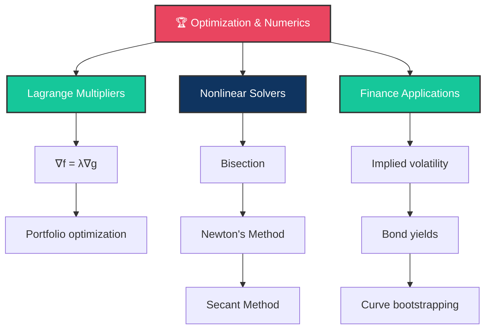

# 🏆 Day 14: Optimization and Numerical Methods

> [!target] **Goal**
> The capstone — Lagrange multipliers for portfolio optimization, Newton's method for nonlinear equations, implied volatility computation, and yield curve bootstrapping.

> [!nav] **Navigation**
> **← [[FE Day 13 - Multivariable Calculus for Finance|Day 13]]** | **Home:** [[FE Math Primer MOC|📐 Home]]
> **Key Links:** [[Mean-Variance Optimization]], [[Implied Volatility]], [[Yield Curve Bootstrapping]]

---

## Concept Map



---

## Topics

### 1. Lagrange Multipliers

> [!def] The Problem
> $$\min_{x_1, \ldots, x_n} f(x_1, \ldots, x_n) \quad \text{subject to} \quad g(x_1, \ldots, x_n) = 0$$

> [!important] Lagrange Condition
> At the optimum, the gradients are parallel:
> $$\nabla f = \lambda \nabla g$$
>
> Solve simultaneously with the constraint $g = 0$ to find $(x^*, \lambda^*)$.

> [!tip] Intuition
> At optimum, any improvement in $f$ **must** violate the constraint $g = 0$.
>
> Mathematically: $\nabla f$ (direction of improvement) is perpendicular to the constraint surface, which has normal $\nabla g$.

> [!money] Portfolio Application
> Minimize portfolio variance $\sigma_p^2 = \mathbf{w}^T \Sigma \mathbf{w}$
>
> Subject to:
> - $\mathbf{w}^T \mathbf{1} = 1$ (weights sum to 1)
> - $\mathbf{w}^T \boldsymbol{\mu} = \mu_{\text{target}}$ (achieve target return)
>
> Lagrangian: $L = \mathbf{w}^T \Sigma \mathbf{w} - \lambda_1(\mathbf{w}^T \mathbf{1} - 1) - \lambda_2(\mathbf{w}^T \boldsymbol{\mu} - \mu_{\text{target}})$
>
> First-order: $\frac{\partial L}{\partial \mathbf{w}} = 0 \Rightarrow 2\Sigma\mathbf{w} = \lambda_1 \mathbf{1} + \lambda_2 \boldsymbol{\mu}$

---

### 2. One-Dimensional Nonlinear Solvers

#### Bisection Method

> [!def] Algorithm
> Given $f(a) < 0 < f(b)$, repeatedly bisect:
> 1. $c = (a+b)/2$
> 2. If $f(c) < 0$: $a \leftarrow c$; else $b \leftarrow c$
> 3. Repeat until $|b-a| < \text{tolerance}$

> [!important] Convergence
> - **Linear**: $O(\log_2(1/\epsilon))$ iterations for accuracy $\epsilon$
> - **Guaranteed**: Always converges (if $f(a)$ and $f(b)$ have opposite signs)
> - **Downside**: Slow (only 1 new bit of accuracy per iteration)

> [!success] When to Use
> When you need **guaranteed** convergence and don't have derivatives.

#### Newton's Method (1D)

> [!def] Algorithm
> $$x_{n+1} = x_n - \frac{f(x_n)}{f'(x_n)}$$
>
> Repeat until $|x_{n+1} - x_n| < \text{tolerance}$

> [!important] Convergence
> **Quadratic**: Each iteration **doubles the number of correct digits**.
> - Start: 1 correct digit
> - Iteration 1: 2 correct digits
> - Iteration 2: 4 correct digits
> - Iteration 5: 32 correct digits ✓

> [!tip] Dangers
> - **Bad starting point**: May diverge (e.g., $f'(x_n) \approx 0$)
> - **Flat regions**: Slow near inflection points
> - **Oscillation**: Can jump around for non-convex $f$

> [!success] When to Use
> When you have $f$ and $f'$, and a good starting point.

#### Secant Method

> [!def] Algorithm
> $$x_{n+1} = x_n - f(x_n) \cdot \frac{x_n - x_{n-1}}{f(x_n) - f(x_{n-1})}$$
>
> Approximates Newton's derivative using finite difference.

> [!important] Convergence
> **Superlinear**: Order $\phi \approx 1.618$ (golden ratio)
>
> Better than bisection, not as fast as Newton, but no derivative needed.

---

### 3. N-Dimensional Newton's Method

> [!def] Algorithm
> Solve $F: \mathbb{R}^n \to \mathbb{R}^n$, i.e., $F(x) = 0$ where $F = (f_1, \ldots, f_n)^T$
>
> $$x_{n+1} = x_n - J(x_n)^{-1} F(x_n)$$
>
> where $J$ is the $n \times n$ Jacobian matrix: $J_{ij} = \frac{\partial f_i}{\partial x_j}$

> [!important] Implementation
> Don't invert $J$; instead solve $J \Delta x = F$:
> 1. Compute $F(x_n)$ and $J(x_n)$
> 2. Solve $J(x_n) \Delta x = -F(x_n)$ for $\Delta x$ (LU decomposition)
> 3. Set $x_{n+1} = x_n + \Delta x$

> [!tip] Approximate Newton
> Replace $J$ with finite difference approximation to avoid computing Jacobian analytically.

---

### 4. Computing Bond Yields

> [!money] Problem
> Given market price $P$ and cash flow dates, find yield-to-maturity $y$ such that:
> $$P = \sum_{i=1}^n C_i e^{-y t_i} + \text{FV} \cdot e^{-y t_n}$$

> [!important] Newton's Method
> $$y_{n+1} = y_n - \frac{P_{\text{comp}}(y_n) - P}{-D \cdot P_{\text{comp}}(y_n)}$$
>
> where $D$ is the modified duration (derivative of bond price w.r.t. yield).
>
> **Converges in 3-4 iterations** typically.

---

### 5. Implied Volatility

> [!money] Problem
> Given market call price $C_{\text{market}}$, find $\sigma$ such that:
> $$\text{BS}(S, K, r, T, \sigma) = C_{\text{market}}$$

> [!important] Newton's Method
> $$\sigma_{n+1} = \sigma_n - \frac{\text{BS}(\sigma_n) - C_{\text{market}}}{\text{Vega}(\sigma_n)}$$
>
> where **Vega** (derivative of option price w.r.t. vol) is the denominator.

> [!success] Why This Works
> - BS is smooth and monotone in $\sigma$
> - Vega is always positive (well-defined Newton step)
> - **Converges in 3-5 iterations** from any starting point
> - Starting guess: $\sigma_0 \approx \frac{C_{\text{market}}}{0.4 \cdot S \cdot \sqrt{T}}$ (from ATM approximation!)

> [!code] Pseudocode
> ```python
> def implied_vol(S, K, r, T, C_market, tol=1e-8):
>     sigma = C_market / (0.4 * S * np.sqrt(T))  # Initial guess
>     for _ in range(100):
>         call = bs_call(S, K, r, T, sigma)
>         vega = bs_vega(S, K, r, T, sigma)
>         sigma = sigma - (call - C_market) / vega
>         if abs(call - C_market) < tol:
>             return sigma
>     return sigma
> ```

---

### 6. Bootstrapping Zero Rate Curves

> [!money] Problem
> Given market prices $P_1, P_2, \ldots, P_n$ of bonds with maturities $T_1, T_2, \ldots, T_n$,
> recover the zero coupon curve $r(T)$.

> [!important] Sequential Algorithm
> 1. **First bond**: Solve $P_1 = e^{-r(T_1) T_1}$ for $r(T_1)$
> 2. **Second bond**: Using known $r(T_1)$, solve for $r(T_2)$:
>    $$P_2 = C e^{-r(T_1) T_1} + (1 + C) e^{-r(T_2) T_2}$$
>    (Newton's method in $r(T_2)$)
> 3. **Continue**: Each step uses Newton on the unknowns

> [!tip] Why Sequential Works
> Each bond's price depends on **only one unknown** rate (the others are already known from previous steps).
>
> So it's a 1D Newton problem, not N-D.

---

### 7. Optimal Portfolio Weights (Markowitz)

> [!money] Problem
> Given covariance $\Sigma$ and expected returns $\boldsymbol{\mu}$, find minimum-variance portfolio with target return $\mu_t$:
>
> $$\min_{\mathbf{w}} \mathbf{w}^T \Sigma \mathbf{w} \quad \text{s.t.} \quad \mathbf{w}^T \mathbf{1} = 1, \quad \mathbf{w}^T \boldsymbol{\mu} = \mu_t$$

> [!important] Lagrangian Solution
> $$\mathbf{w}^* = \frac{1}{2}\Sigma^{-1}(\lambda_1^* \mathbf{1} + \lambda_2^* \boldsymbol{\mu})$$
>
> Solve for $\lambda_1^*, \lambda_2^*$ using the two constraints:
> $$\begin{bmatrix} \mathbf{1}^T \Sigma^{-1} \mathbf{1} & \mathbf{1}^T \Sigma^{-1} \boldsymbol{\mu} \\ \boldsymbol{\mu}^T \Sigma^{-1} \mathbf{1} & \boldsymbol{\mu}^T \Sigma^{-1} \boldsymbol{\mu} \end{bmatrix} \begin{bmatrix} \lambda_1^* \\ \lambda_2^* \end{bmatrix} = 2 \begin{bmatrix} 1 \\ \mu_t \end{bmatrix}$$

> [!success] Computational Steps
> 1. Compute $\Sigma^{-1}$ (Cholesky factorization)
> 2. Form the 2×2 system above
> 3. Solve for $\lambda_1^*, \lambda_2^*$
> 4. Compute $\mathbf{w}^*$

---

## Interview Preparation

> [!question] **Q1: Implied Volatility Algorithm**
> "How do you compute implied volatility? Walk me through the algorithm."

> [!success] Answer
> **Newton-Raphson** with BS pricing function and Vega as derivative:
> $$\sigma_{n+1} = \sigma_n - \frac{\text{BS}(\sigma_n) - C_{\text{market}}}{\text{Vega}(\sigma_n)}$$
>
> - Start: ATM approximation $\sigma_0 \approx C_{\text{market}} / (0.4 S \sqrt{T})$
> - Converges: 3-5 iterations, very stable

> [!question] **Q2: Quadratic Convergence**
> "Newton's method has quadratic convergence. What does that mean practically?"

> [!success] Answer
> Each iteration **doubles the number of correct digits**.
>
> Starting from 1-2 correct digits, you get: 2 → 4 → 8 → 16 → 32 digits in just 5 iterations.
>
> Machine precision (≈16 digits double) is reached by iteration 4-5 from any reasonable start.

> [!question] **Q3: Bootstrapping Zero Curves**
> "How would you construct a zero rate curve from market bond data?"

> [!success] Answer
> **Bootstrapping**: Sequential approach:
> 1. Shortest maturity bond → solve for $r(T_1)$ directly
> 2. Next bond uses $r(T_1)$ → solve for $r(T_2)$ (Newton's method)
> 3. Continue for longer maturities
>
> Each step is 1D Newton, very stable.

> [!question] **Q4: Markowitz Optimal Portfolio**
> "Derive the optimal portfolio weights in Markowitz framework with two constraints."

> [!success] Answer
> Lagrangian with budget + target return constraints:
> $$L = \mathbf{w}^T \Sigma \mathbf{w} - \lambda_1(\mathbf{w}^T \mathbf{1} - 1) - \lambda_2(\mathbf{w}^T \boldsymbol{\mu} - \mu_t)$$
>
> First-order: $2\Sigma\mathbf{w} = \lambda_1 \mathbf{1} + \lambda_2 \boldsymbol{\mu}$ → $\mathbf{w} = \frac{1}{2}\Sigma^{-1}(\lambda_1 \mathbf{1} + \lambda_2 \boldsymbol{\mu})$
>
> Substitute into constraints to solve 2×2 system for $\lambda_1, \lambda_2$.

---

## Exercises to Complete

- [ ] **Exercise 1:** Implement bisection, Newton, and secant methods in Python; compare iteration counts
- [ ] **Exercise 2:** Compute implied vol for $C=10.45, S=100, K=100, r=5\%, T=1$ using Newton
- [ ] **Exercise 3:** Implement bootstrapping algorithm for a 3-bond example with given prices
- [ ] **Exercise 4:** Solve the Markowitz problem for a 3-asset portfolio with given $\Sigma$ and $\boldsymbol{\mu}$
- [ ] **Exercise 5:** Plot convergence: bisection vs Newton vs secant (iterations vs error)
- [ ] **Exercise 6:** Implement Stefanica's pseudocode (Tables 8.1–8.7)
- [ ] **Exercise 7:** Solve for bond yield given $P=\$95, C=5\%, \text{maturity}=5$ years using Newton

---

## Study Materials

> [!abstract] **Study Materials**
> Populated during study.
>
> **Key Links**: [[Mean-Variance Optimization]], [[Implied Volatility]], [[Yield Curve Bootstrapping]], [[Newton's Method Applications]]
>
> **Key Takeaway**: Optimization and numerical solvers are the practical foundation of quantitative finance. Every pricing problem, every calibration, every portfolio construction ultimately reduces to one of these algorithms.

---

#FE-primer #day-14 #optimization #newton-method #implied-volatility #bootstrapping
