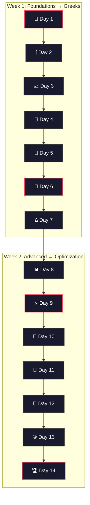

# 📐 Financial Engineering Mathematics Primer

> [!abstract] **Mission**
> A 14-day structured study plan through the mathematical foundations every quant needs — built from **Dan Stefanica's Baruch MFE primer** with connections to interview prep and real trading intuition.

> [!tip] **Philosophy**
> Start from **first principles** (BFS) → build the full landscape → go deep on each node as you progress.

---

## The 14-Day Roadmap



---

### Week 1 — Foundations → Black-Scholes → Greeks

| | Day | Topic | Ch. | Key Deliverable |
|:---:|:---:|-------|:---:|-----------------|
| ⬜ | 1 | [[FE Day 01 - Mathematical Preliminaries\|🔢 Mathematical Preliminaries]] | 0 | Even/odd functions, recursions, big-O |
| ⬜ | 2 | [[FE Day 02 - Calculus Review and Options Intro\|∫ Calculus Review]] | 1.1–1.6 | Differentiation, integration, limits |
| ⬜ | 3 | [[FE Day 03 - Options and Arbitrage-Free Pricing\|📈 Options & Arbitrage]] | 1.7–1.12 | Calls, puts, put-call parity |
| ⬜ | 4 | [[FE Day 04 - Numerical Integration and Interest Rates\|🔬 Numerical Integration]] | 2.1–2.5 | Midpoint, trapezoidal, Simpson |
| ⬜ | 5 | [[FE Day 05 - Bonds Duration Convexity\|🏦 Bonds & Duration]] | 2.6–2.10 | Bond pricing, yield, duration |
| ⬜ | 6 | [[FE Day 06 - Probability and Black-Scholes\|🎲 Probability & BS]] | 3.1–3.5 | Normal variables, BS formula |
| ⬜ | 7 | [[FE Day 07 - Greeks and Hedging\|Δ Greeks & Hedging]] | 3.6–3.10 | All Greeks, implied vol, hedging |

### Week 2 — Advanced Theory → Numerical Methods → Optimization

| | Day | Topic | Ch. | Key Deliverable |
|:---:|:---:|-------|:---:|-----------------|
| ⬜ | 8 | [[FE Day 08 - Lognormal Variables and Risk-Neutral Pricing\|📊 Lognormal & Risk-Neutral]] | 4.1–4.5 | Change of variables, lognormal RVs |
| ⬜ | 9 | [[FE Day 09 - Black-Scholes Derivation and N(d1) N(d2)\|⚡ BS Derivation]] | 4.6–4.11 | Risk-neutral derivation, N(d₁) N(d₂) |
| ⬜ | 10 | [[FE Day 10 - Taylor Formula and Series\|📐 Taylor Formula]] | 5.1–5.3 | 1D/2D Taylor, convergence |
| ⬜ | 11 | [[FE Day 11 - Taylor Applications to Finance\|🎯 Taylor in Finance]] | 5.4–5.8 | ATM approx, duration-convexity link |
| ⬜ | 12 | [[FE Day 12 - Finite Differences and Black-Scholes PDE\|🔲 FD & BS PDE]] | 6 | Finite differences, BS PDE |
| ⬜ | 13 | [[FE Day 13 - Multivariable Calculus for Finance\|🌐 Multivariable Calc]] | 7 | Box-Muller, heat equation, barriers |
| ⬜ | 14 | [[FE Day 14 - Optimization and Numerical Methods\|🏆 Optimization]] | 8 | Newton, implied vol, bootstrapping |

---

## Daily Workflow

> [!example] **How to Use Each Day**
> ```
> ① READ    → BFS concept map (understand the landscape)
> ② DERIVE  → Work through every derivation by hand
> ③ CODE    → Implement in Python or C++
> ④ CONNECT → Follow wikilinks to existing vault notes
> ⑤ TEST    → Interview section — practice Q&A out loud
> ```

---

## Vault Connections

> [!info] **Mathematical Scaffolding**
> This primer feeds directly into:

| Domain | Days | Links To |
|--------|------|----------|
| **Options Pricing** | 3, 6, 7, 8, 9 | [[Black-Scholes Framework]] · [[Put-Call Parity]] · [[Risk-Neutral Pricing]] |
| **Greeks & Hedging** | 7, 10, 11, 12 | [[Delta]] · [[Gamma]] · [[Theta]] · [[Vega]] |
| **Fixed Income** | 4, 5, 11 | [[Bond Pricing Fundamentals]] · [[Duration and Convexity]] · [[Yield Curve Bootstrapping]] |
| **Stochastic Calculus** | 8, 9, 13 | [[Brownian Motion]] · [[Itô's Lemma]] · [[Geometric Brownian Motion]] |
| **Numerical Methods** | 4, 12, 14 | [[Monte Carlo Methods]] · [[Finite Difference Methods]] · [[Implied Volatility]] |
| **Interview Prep** | All | [[Interview Preparation MOC]] |

---

## Formula Index

> [!note] **Quick Reference**
> Update status as you master each formula.

| Formula | Day | Mastered |
|---------|:---:|:--------:|
| Taylor's theorem (1D and 2D) | 10 | ⬜ |
| **Black-Scholes formula** | 6 | ⬜ |
| **Black-Scholes PDE** | 12 | ⬜ |
| Put-Call Parity | 3 | ⬜ |
| Greeks (Δ, Γ, Θ, ν, ρ) | 7 | ⬜ |
| ATM approximation | 11 | ⬜ |
| Newton's method (1D & ND) | 14 | ⬜ |
| Simpson's rule | 4 | ⬜ |
| Duration-Convexity | 5, 11 | ⬜ |
| Box-Muller method | 13 | ⬜ |
| Lagrange multipliers | 14 | ⬜ |
| Implied volatility algorithm | 14 | ⬜ |
| Bootstrapping zero curves | 14 | ⬜ |

---

> [!quote] **Why This Matters**
> Every quant interview chain — from "state the formula" to "what breaks in practice?" — rests on whether you **own** the math or merely **rent** it.

#MOC #financial-engineering #study-plan #stefanica
